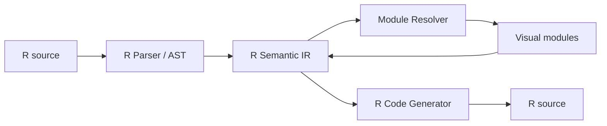
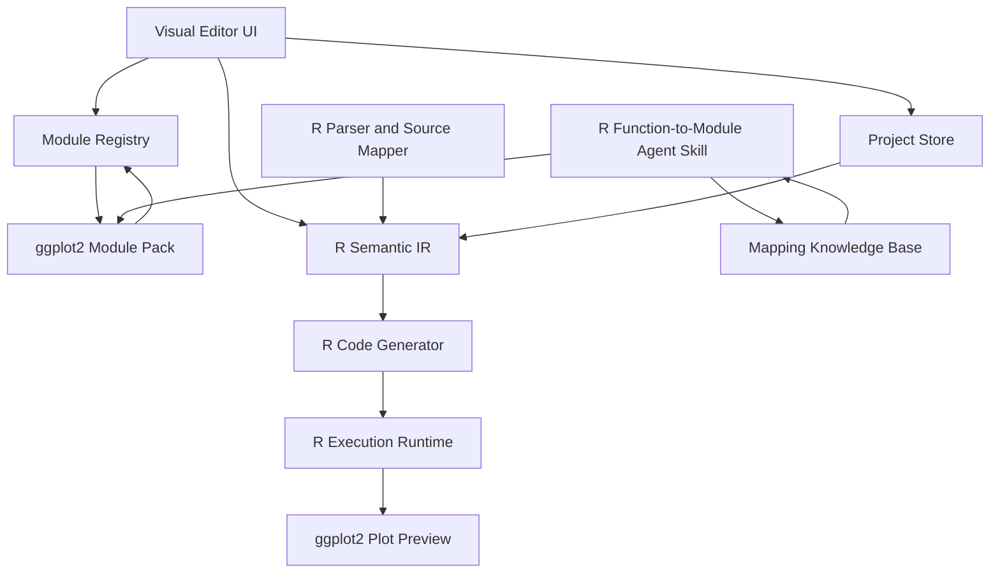
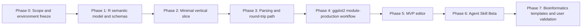

# BioPlotBlocks Development Process and Requirements Specification

> Project codename: **BioPlotBlocks** (provisional)  
> Current phase: scope freeze, rule design, and architectural validation  
> Overall language scope: **R only**  
> Initial package scope: **ggplot2 only**  
> Initial vertical application: **bioinformatics research visualization**

## 0. About This Document

### 0.1 Purpose

This document aligns the project on product positioning, scope boundaries, functional requirements, the R semantic model, ggplot2 module-adaptation rules, development workflow, testing strategy, versioning policy, and phase-gate acceptance criteria. It SHALL serve as the common reference for:

- project initiation, scope review, and requirements-change control;
- product prototyping, interaction design, and usability testing;
- R code parsing, generation, execution, and project persistence;
- mapping ggplot2 functions to visual modules;
- design of `ModuleSpec`, the R Semantic IR, and the module registry;
- design, implementation, validation, and iteration of the Agent Skill;
- construction of bioinformatics plotting templates;
- interfaces and review requirements for adding other R packages after the initial release.

This document does not define delivery requirements for any non-R language, and multilingual compatibility is not a current architectural objective. Any future support for a non-R language MUST be initiated and governed as a separate project; it MUST NOT retroactively expand the initial scope of this project.

### 0.2 Normative Language

The following terms indicate requirement strength:

- **MUST**: failure to satisfy the requirement constitutes a violation of a core design principle or an acceptance failure;
- **SHOULD**: the requirement is expected to be satisfied unless there is a documented, review-approved exception;
- **MAY**: an optional capability that is not required for the initial release.

### 0.3 Applicability

This document covers:

1. the visual editor;
2. the R Semantic IR, parser, code generator, and controlled execution runtime;
3. the initial ggplot2 Module Pack;
4. the declarative module specification, `ModuleSpec`;
5. function-to-module mapping rules;
6. synchronization, degradation, and round-trip behavior between code and modules;
7. the module-authoring Agent Skill;
8. the bioinformatics template layer;
9. testing, documentation, release, compatibility, and knowledge-management workflows;
10. the package-level extension contract required before other R packages can be integrated.

The initial core scope excludes computational bioinformatics workflows such as differential expression, enrichment analysis, and single-cell analysis. It also excludes code-visualization adapters for Python, JavaScript, or any other non-R language.

### 0.4 Scope Revisions in v0.2

Compared with v0.1, this version makes the following scope-level revisions:

1. **The entire project is restricted to R.** The core IR, parser, code generator, and runtime may explicitly use R syntax and R language objects; they are no longer required to remain language-neutral.
2. **The initial release adapts ggplot2 only.** The initial module library, Agent generation scope, compatibility matrix, acceptance tests, and bioinformatics templates MUST NOT depend on any other R package.
3. **The extension axis changes from language adapters to R package adapters.** Future extensions SHALL be delivered as additional R Package Module Packs rather than additional Language Adapters.
4. **Other R packages remain architecturally possible but are excluded from the initial schedule.** Packages such as `ggrepel`, `ggpubr`, `patchwork`, `dplyr`, and `ComplexHeatmap` are later candidates, not MVP dependencies.
5. **Mapping knowledge is recorded from the first module onward.** The Agent Skill is not an end-of-project add-on; it SHALL emerge incrementally from human mapping records, schemas, tests, and review workflows.

### 0.5 Scope-Freeze Matrix

| Level | Current decision | Initial-release status |
|---|---|---|
| Programming language | R only | Frozen |
| Initial plotting package | ggplot2 only | Frozen |
| Other R packages | Architecture may allow later integration, but no implementation | Excluded from MVP |
| Non-R languages | No design, testing, or commitment | Out of scope |
| Bioinformatics computation | Existing results may be visualized; analyses are not executed | Out of scope |
| Code optimization or automatic beautification | Not performed | Out of scope |
| Function-to-module rules and Agent Skill | Must be developed in parallel | Initial-release deliverable |

> **Scope clarification:** “R only” refers to the user code that is modeled, parsed, generated, and executed. The interface implementation MAY use HTML, CSS, JavaScript, or TypeScript components required by Shiny, but these technologies MUST NOT become user-code modules or expand the code-adaptation scope.

# 1. Project Definition

## 1.1 One-Sentence Definition

BioPlotBlocks is an **R-only code-visualization and modular-composition system initially adapting ggplot2 only**. It maps R function calls, arguments, symbols, nested expressions, and operators to editable visual modules, while generating, displaying, executing, and—where supported—reconstructing the corresponding R code without changing the original code semantics or the ggplot2 parameter model.

## 1.2 Nature of the Project

This project does not invent a new plotting grammar and does not automatically improve ggplot2 code. Its essential purpose is:

> To place a faithful, visual, editable, and traceable interaction layer around existing R/ggplot2 code.

The interface is not a new plotting language. It is an alternative representation of the original R code. Every visible module, argument, nesting relation, and connection MUST be traceable to a concrete R function call, actual argument, symbol, expression, or operator.

## 1.3 Bioinformatics Vertical Positioning

Bioinformatics is the initial application domain, but it MUST NOT be hard-coded into the R semantic core or the ggplot2 module mechanism. The vertical positioning is expressed primarily through:

- prioritizing ggplot2 functions frequently used in bioinformatics research;
- validating module composition with real tasks such as volcano plots, PCA/UMAP plots, expression-comparison plots, and enrichment plots;
- providing bioinformatics example data, tutorials, test tasks, and user studies;
- developing domain-informed parameter-grouping practices and mapping examples for research visualization;
- evaluating independent Module Packs for other R packages only after the initial release is complete.

Bioinformatics templates MUST be composed of visible ggplot2 base modules. They MUST NOT conceal data transformation, statistical computation, or calls to other packages.

## 1.4 Scope Layers

The project scope is divided into three layers.

### Current Core Scope

- R syntax and R language objects;
- parsing, generating, executing, and storing R code;
- a generic mapping mechanism from R functions to visual modules;
- package-level module registration and version management within R.

### Initial Implementation Scope

- ggplot2 function modules;
- ggplot2 `+` composition semantics;
- `ggplot()`, `aes()`, selected `geom_*()` functions, scales, facets, labels, and themes;
- a single ggplot object expression with an optional assignment;
- bioinformatics composition templates built from ggplot2 modules.

### Candidate Scope After the Initial Release

- other R plotting packages or ggplot2 extension packages;
- R data-manipulation packages;
- more complex R expressions and metaprogramming support.

Candidate items are not commitments. They may enter a later release only after the initial release passes acceptance and a stable package-extension contract has been demonstrated.

## 1.5 Product Responsibility Boundary

The system is responsible for:

- visualizing supported R/ggplot2 code structures;
- allowing users to edit real functions and real arguments through modules;
- generating executable and auditable R code;
- reporting syntax, argument, deprecation, and compatibility issues;
- preserving legal R expressions that cannot be structurally represented;
- recording module-mapping provenance, versions, and test evidence.

The system is not responsible for:

- determining whether a plot choice is scientifically appropriate;
- determining whether a statistical method is correct;
- automatically optimizing code, layers, themes, or color schemes;
- silently adding missing data transformations;
- executing bioinformatics analyses;
- presenting functionality from other R packages as if it were native ggplot2 functionality.

# 2. Core Principles

## 2.1 Principle 1: R-Only Overall, ggplot2-Only Initially

The current project targets R only. The core semantic model MAY explicitly represent the following R concepts:

- R function calls and language objects;
- named and unnamed actual arguments;
- missing arguments;
- symbols, literals, and special constants;
- formulas;
- operator calls;
- namespace access;
- expressions involving non-standard evaluation;
- source locations, comments, and original source text;
- R packages, R versions, and package-version constraints.

The initial release SHALL implement only the ggplot2 Module Pack. Core code MUST NOT hard-code a particular `geom_*()` name, but it MAY depend on R semantics. The future extension unit is another R package, not another programming language.

The project SHALL follow an “extensible without pre-implementing” strategy:

- the core registry MAY later load additional R Package Module Packs;
- the initial release MUST NOT introduce abstractions solely for hypothetical non-R languages;
- the initial release MUST NOT add complexity for unconfirmed future R packages;
- each new abstraction MUST be justified by an actual ggplot2 requirement or by at least one formally approved R-package extension requirement.

## 2.2 Principle 2: Represent Code Faithfully; Do Not Improve It

The system MUST observe the following boundaries:

- do not automatically refactor user code;
- do not automatically substitute functions;
- do not automatically alter argument values;
- do not automatically replace a plotting approach with a supposedly better one;
- do not automatically add statistical tests, colors, labels, themes, or data transformations;
- do not automatically reorder layers;
- do not silently discard an expression because the interface cannot represent it;
- do not change code semantics under the pretext of optimization, correction, or recommendation.

The system MAY provide non-invasive capabilities such as:

- R syntax-error reporting;
- ggplot2 argument, deprecation, and version-compatibility warnings;
- argument-type or recommended-range hints;
- direct display of errors, warnings, and messages emitted by ggplot2 or R;
- semantics-preserving code formatting;
- template insertion or module replacement explicitly initiated by the user;
- migration operations performed only after explicit user acceptance.

Any operation that may change semantics MUST be explicitly initiated by the user and MUST display a diff before execution. The project primarily guarantees **semantic fidelity**; character-for-character textual fidelity is not an initial-release commitment.

## 2.3 Principle 3: Match the Target ggplot2 Version’s Native Parameter Model

Module argument names, sources, defaults, meanings, and constraints MUST be derived from the actual function objects, official documentation, and observed runtime behavior of the target ggplot2 version.

“Common settings” and “advanced settings” are interface groupings only. They MUST NOT change:

- whether an argument exists;
- the argument’s real name;
- the argument’s default value;
- how the argument enters the function call;
- the R type of the supplied value;
- forwarding semantics through `...`;
- generated code;
- the function’s actual interpretation of the argument.

The system MUST NOT invent pseudo-arguments that do not exist in ggplot2. A composite UI control MAY map to one or more real arguments, but that mapping MUST be explicit and the corresponding R code MUST remain visible.

## 2.4 Principle 4: Accumulate R Function-to-Visual-Module Mapping Knowledge

Whenever an R function is mapped to a visual module, the following information MUST be recorded:

- R version, package name, package version, and function source;
- function signature and export status;
- formal arguments, missing arguments, and the destination of `...`;
- value types and special R semantics;
- the rationale for common/advanced grouping;
- the rationale for control selection;
- composition context and return object;
- code-generation and parsing rules;
- examples, edge cases, and failure cases;
- portions that cannot be mapped automatically;
- human decisions, evidence, and review conclusions;
- actual execution and round-trip test results in the target environment.

This knowledge MUST ultimately be consolidated into:

1. a machine-readable `ModuleSpec`;
2. a unified set of R function-mapping rules;
3. a unified set of ggplot2-specific semantic rules;
4. a module-development checklist;
5. an executable Agent Skill;
6. a process for automated validation, human review, versioning, and release.

## 2.5 Principle 5: Unsupported R Expressions Must Degrade Without Loss

Insufficient visualization capability MUST NOT justify deleting or rewriting valid R code. Any expression that cannot be structured reliably MUST degrade to an `RRawExpression`, a raw R argument value, or a read-only source fragment while preserving:

- original source text;
- source location;
- the owning argument or composition position;
- the reason structural parsing failed;
- whether editing and execution are allowed;
- version information required for future reparsing.

Degradation MUST be visible and MUST NOT be presented as complete support.

## 2.6 Principle 6: Modules Must Be Declarative, Testable, and Versioned

Ordinary ggplot2 function modules SHOULD be introduced primarily through a ModuleSpec, a mapping record, and tests—not by modifying the core editor. Every module MUST be associated with:

- a module-definition version;
- a ModuleSpec Schema version;
- an R compatibility range;
- a ggplot2 compatibility range;
- a mapping-rule version;
- test cases and snapshots;
- a stability level;
- a change log and review state.

# 3. Project Goals and Non-Goals

## 3.1 Initial-Release Goals

The initial release SHALL deliver the following outcomes:

1. display supported ggplot2 code as editable modules;
2. generate executable R/ggplot2 code reliably from visual modules;
3. preserve the target ggplot2 version’s native parameter model in the parameter panel;
4. group common and advanced arguments while allowing users to inspect all native arguments;
5. distinguish unset, explicit default, `NULL`, `NA`, symbols, strings, and expressions correctly;
6. support one ggplot object expression, an optional assignment, and a `+` layer chain;
7. preserve unrecognized expressions through lossless degradation;
8. drive modules from declarative ModuleSpec definitions rather than hand-written pages;
9. round-trip supported code generated by the software itself reliably;
10. produce at least one repeatable Agent Skill prototype for authoring ggplot2 function modules;
11. provide several bioinformatics templates that depend on ggplot2 only;
12. establish reusable testing, versioning, documentation, and human-review workflows.

## 3.2 Explicit Non-Goals

The initial release does not aim to:

- replace RStudio, Positron, or a complete R IDE;
- visualize arbitrary R programs in full;
- model complex script control flow among multiple plot objects;
- automatically optimize, refactor, or beautify code;
- determine whether plots, statistics, or scientific conclusions are correct;
- perform bioinformatics analyses automatically;
- support every ggplot2 function, every argument combination, or every metaprogramming scenario;
- treat packages such as `ggrepel`, `ggpubr`, `patchwork`, `cowplot`, `dplyr`, or `ComplexHeatmap` as first-class initial modules;
- reproduce all hand-written formatting, comments, or coding style exactly;
- support Python, JavaScript, or any non-R language;
- design a general multilingual AST, runtime, or plugin platform;
- execute arbitrary unrestricted user code;
- provide real-time multi-user collaboration;
- host research data indefinitely in the cloud.

## 3.3 Definition of Initial-Release Completion

Success is not measured by maximizing the number of modules. It is determined by the reliability of the following chain:

```text
Real ggplot2 function and documentation
→ Mapping record
→ ModuleSpec
→ Parameter UI
→ R Semantic IR
→ R code generation
→ Real ggplot2 execution
→ Parsing and round-trip tests
→ Human review
```

Only after this chain is stable is there a sound basis for adapting other R packages.

# 4. Users and Representative Workflows

## 4.1 Core Users

### A. Bioinformatics Students

Need: understand the composition of ggplot2 calls and the meaning of arguments through modules while obtaining real R code that can be studied and modified further.

### B. Research-Visualization Users

Need: compose existing ggplot2 functions quickly, reducing the cost of searching documentation and repeatedly rewriting arguments while preserving full code and reproducibility.

### C. Module Developers

Need: map a new ggplot2 function to a module according to unified rules without rebuilding the frontend.

### D. ggplot2 Module Maintainers

Need: use `ModuleSpec + Agent Skill` to generate an initial module definition for an unadapted ggplot2 function, then review and release it. Maintainers of other R-package packs are potential users after the initial release.

## 4.2 Representative Workflows

### Scenario 1: Generate Code from Modules

```text
Open project
→ Select data or example data
→ Add ggplot module
→ Add aes module
→ Add geom_point module
→ Configure common arguments
→ Expand advanced arguments
→ Inspect live code
→ Execute preview
→ Export R script or save project
```

### Scenario 2: Recover Modules from Supported Code

```text
Paste R/ggplot2 code
→ Parse AST
→ Identify functions, arguments, and + composition
→ Build module chain
→ Convert unrecognized parts to Raw R Expressions
→ Continue editing
→ Regenerate code
```

### Scenario 3: Start from a Template

```text
Choose “Volcano plot” template
→ Insert a fully visible combination of ggplot2 modules
→ Replace data-column mappings
→ Modify native arguments of each function
→ Inspect code and plot
```

### Scenario 4: Generate a New Module

```text
Developer specifies ggplot2 function, R version, and ggplot2 version
→ Agent reads the locked environment’s function signature and documentation
→ Generate ModuleSpec draft
→ Generate tests and mapping notes
→ Run automated validation
→ Perform human review
→ Add to module registry
```

---

# 5. Core Terminology

| Term | Definition |
|---|---|
| Visual Module | A visual representation of an R code entity, commonly a function call, operator, symbol, or expression |
| ModuleSpec | A declarative specification describing module identity, R-package source, arguments, controls, composition rules, versions, evidence, and test requirements |
| R Semantic IR | A shared R-semantic intermediate representation used by code and module views; it is neither the UI nor source text itself |
| R Parser | Component that parses R source into syntax structure, source locations, and R Semantic IR |
| R Code Generator | Component that deterministically emits R source from R Semantic IR |
| R Execution Runtime | Component that executes generated code within an explicit environment and safety boundary and returns ggplot objects, errors, warnings, messages, and version information |
| Package Module Pack | A set of ModuleSpecs, composition rules, documentation, and tests for one R package; the initial release includes only the ggplot2 Module Pack |
| Raw Expression | An R expression that cannot be structured reliably but must be preserved losslessly |
| Common Settings | Frequently used native arguments shown by default without changing underlying semantics |
| Advanced Settings | Other native arguments, `...`, and complex-expression settings that are collapsed by default |
| Round-trip | Semantic conversion from code to modules and back to code, or from modules to code and back to modules |
| Template | A predefined composition of ordinary ggplot2 modules with no hidden logic |
| Mapping Record | A knowledge artifact documenting evidence, exceptions, versions, and test results for an R function-to-module mapping |
| Stability Level | A module’s `draft`, `experimental`, `beta`, `stable`, `deprecated`, or `unsupported` status |

# 6. Product Functional Requirements

## 6.1 Workspace

The system MUST provide a unified workspace containing at least:

1. a module library;
2. a module canvas or layer-composition area;
3. a parameter panel;
4. an R code view;
5. a plot-preview area;
6. an error, warning, and package-version area.

Recommended layout:

```text
┌──────────────┬────────────────────────┬──────────────────┐
│ Module       │ Module/layer stack     │ Parameter panel  │
│ library      │                        │                  │
│              │ ggplot(data = df)      │ Common settings  │
│ Core         │          +             │ Advanced settings│
│ ggplot2      │ geom_point(...)        │ Argument docs    │
│ Templates    │          +             │ Provenance       │
│ Raw R        │ theme_classic()        │ Expression mode  │
├──────────────┴────────────────────────┴──────────────────┤
│ Plot preview                       │ R code view         │
└──────────────────────────────────────────────────────────┘
```

## 6.2 Module Library

The module library MUST support:

- filtering by R package, module category, and stability level;
- search by function name, alias, and documentation keyword;
- display of package ownership and compatible versions;
- display of stable, experimental, or deprecated status;
- drag-to-add or click-to-add interactions;
- access to module descriptions, examples, and sources;
- clear distinction among function modules, operator modules, expression modules, and templates.

Templates and function modules MUST NOT be presented as the same abstraction level. A template is an entry point that expands into multiple modules.

## 6.3 Module Composition

The composition area MUST support:

- adding, deleting, and duplicating modules;
- drag reordering;
- expanding and collapsing modules;
- selecting the active module;
- displaying the full function and package name;
- displaying a summary of key arguments;
- displaying composition operators;
- displaying nested modules;
- immediate feedback for invalid connections;
- preservation of unrecognized expressions;
- undo and redo;
- synchronized highlighting between module and source-code locations.

The initial release MAY use a linear layer stack with nested argument slots. An infinite node-canvas is not required initially.

## 6.4 Parameter Panel

The parameter panel MUST:

- use the actual function argument names;
- display each argument’s source: formal, `...`, derived aesthetic, or nested expression;
- distinguish Common Settings, Advanced Settings, and an All Arguments audit view;
- display the original default expression;
- distinguish unset from explicitly set-to-default;
- allow switching between a graphical control and raw R-expression input;
- display argument help and documentation provenance;
- provide constraint warnings without silently correcting values;
- display the exact code fragment generated by the current setting.

## 6.5 Code View

The code view MUST support:

- live display of R code corresponding to modules;
- basic syntax highlighting;
- bidirectional navigation between code and modules;
- copying code;
- exporting a `.R` file;
- displaying code-generation warnings;
- switching between concise-code and explicit-argument views;
- indicating the presence of unstructured Raw Expressions;
- reparsing user edits within the supported subset.

The initial release is not required to support fully lossless write-back after arbitrary free-form code edits. If code editing is enabled, the supported subset and parsing result MUST be clearly indicated.

## 6.6 Plot Preview

The plot preview MUST:

- use actual R/ggplot2 execution rather than approximate rendering in another plotting library;
- display execution errors, warnings, and messages;
- avoid hiding errors produced by R packages;
- support manual refresh and optional automatic refresh;
- allow cancellation of long-running execution;
- record the R and package versions used;
- support common preview dimensions and resolutions.

## 6.7 Project Save and Restore

A project file MUST preserve:

- the IR;
- module instances and ordering;
- each argument’s state and value;
- the data-reference strategy;
- R version, ggplot2 version, and module-definition versions;
- ModuleSpec Schema version;
- raw expressions;
- template provenance;
- optional preview settings;
- optional code-format settings.

The project file SHOULD use versioned JSON or an equivalent structure and MUST provide migration support.

## 6.8 Template System

Templates MUST:

- consist of ordinary modules;
- reveal all function calls after expansion;
- perform no hidden data processing;
- preserve each module’s native arguments;
- be savable as user templates;
- describe expected data structure without misrepresenting themselves as statistical-analysis methods.

Initial bioinformatics templates MAY include:

- a basic volcano-plot template;
- a PCA/UMAP scatter-plot template;
- a boxplot/violin expression-comparison template;
- an enrichment dot-plot template;
- other compositions depending on ggplot2 only.

Initial templates MUST NOT depend on `patchwork`, `ggrepel`, `ggpubr`, `dplyr`, or any other add-on package.

## 6.9 Raw R Module

The system MUST provide a Raw R module or equivalent capability for expressions that cannot be structured, for example:

```r
geom_point(size = calculate_size(config))
```

Here, `calculate_size(config)` MUST be stored as an expression rather than a string.

A Raw R module MUST:

- preserve the original code;
- indicate that it cannot be fully edited through graphical controls;
- allow users to inspect and modify it;
- participate in code generation;
- participate in preview execution when permitted by the execution policy;
- never be silently removed or replaced.

---

# 7. Parameter-System Requirements

## 7.1 Authoritative Sources

Argument metadata SHALL be established in the following priority order:

1. the real function object and signature from the locked target-version environment;
2. official help pages and Rd documentation installed with the same version;
3. the same version’s namespace, source, Geom/Stat/Layer objects, or exported objects;
4. same-version official vignettes and examples;
5. actual execution and probing in the target environment;
6. evidence-backed human mapping decisions.

For the initial release, the target package is ggplot2. Each future Package Module Pack MUST establish its own evidence chain.

Third-party tutorials MUST NOT be the sole source of parameter definitions.

## 7.2 Argument-State Model

The system MUST distinguish at least the following states:

| State | Example | Meaning |
|---|---|---|
| `unset` | `alpha` does not appear | Do not emit the argument; defer to the function’s default mechanism |
| `explicit` | `alpha = 0.5` | Explicitly supplied by the user |
| `explicit_default` | `na.rm = FALSE` | Explicitly written value equal to the current default |
| `explicit_null` | `data = NULL` | Explicit `NULL` |
| `explicit_na` | `show.legend = NA` | Explicit `NA` |
| `raw_expression` | `size = f(x)` | Argument value is an arbitrary R expression |
| `inherited` | inherited from global mapping | Not explicitly set on the current module but affects the current layer |

`unset` and `explicit_default` MUST NOT be merged, because package-version changes or internal function logic may make them behave differently.

## 7.3 Argument Value Types

The initial type system MUST support at least:

- character strings;
- doubles and integers;
- logical values;
- `NULL`;
- `NA` including typed NA values;
- `Inf`, `-Inf`, and `NaN`;
- symbols or column references;
- named arguments;
- vectors;
- lists;
- formulas;
- function references;
- function calls;
- `aes()` mappings;
- color values;
- enumerated values;
- arbitrary R expressions.

## 7.4 Common, Advanced, and All-Arguments Views

Grouping affects only the interface’s default presentation. The grouping rationale SHALL be stored in ModuleSpec.

- **Common Settings**: expanded by default; high-frequency native arguments suitable for direct manipulation;
- **Advanced Settings**: collapsed by default; remaining native arguments, complex arguments, and `...`;
- **All Arguments**: audit view for inspecting all argument sources covered by the module and their current states.

Recommended classification criteria:

1. whether the argument appears in the main signature or first-level documentation;
2. whether it is frequent in representative usage;
3. whether it directly affects core mapping or visible appearance;
4. whether it is suitable for a simple control;
5. whether beginners can understand it reasonably;
6. whether exposing it by default avoids excessive cognitive load.

The number of common arguments SHOULD remain restrained. A typical module SHOULD expose approximately 4–10 common arguments by default, placing the rest under Advanced Settings.

Every argument SHOULD remain reachable through Advanced Settings, All Arguments, or raw-expression mode. Grouping MUST NOT permanently hide arguments.

The All Arguments view MUST NOT cause every unset argument to be emitted into generated code; it is an audit and visibility mechanism only.

## 7.5 Control Mapping

Default controls MAY follow these rules:

| Argument semantics | Default control | Fallback mode |
|---|---|---|
| logical | three- or four-state selector | R expression |
| enum | dropdown | R expression |
| number | numeric input | R expression |
| bounded number | numeric input plus range guidance | R expression |
| color | color picker | string or expression |
| symbol/column | data-column selector | R expression |
| formula | formula editor | R expression |
| vector | add/remove list editor | R expression |
| function | function selector or text input | R expression |
| aes mapping | mapping editor | `aes(...)` expression |
| arbitrary expression | code input | none |

Controls may reduce accidental input errors but MUST NOT silently replace an invalid value with another value. The system SHALL warn and leave the decision to the user.

## 7.6 `...` Arguments

R packages frequently receive additional arguments through `...`. The system MUST record origin using at least:

- `formal`: a formal parameter;
- `dots_documented`: an argument explicitly documented under `...`;
- `dots_aesthetic`: a fixed aesthetic accepted through `...`;
- `dots_forwarded`: forwarded to another function;
- `dots_unknown`: destination cannot be determined.

For `dots_unknown`, the system SHOULD provide an arbitrary named-argument editor and mark it as an advanced capability.


# 8. R Semantic Intermediate Representation (R Semantic IR)

## 8.1 Positioning and Design Goals

R Semantic IR is the single semantic source shared by the code view, module view, project file, code generator, and parser. The system MUST NOT use untraceable string concatenation as the primary representation of module state.

Because the project is explicitly restricted to R, the IR does not need to remain language-neutral. It SHOULD represent the R semantics required by the initial release accurately. The IR MUST:

- represent the supported R/ggplot2 syntax subset;
- distinguish R symbols, strings, missing arguments, `NULL`, typed `NA` values, and other special constants;
- represent named and unnamed arguments;
- represent nested functions, formulas, and operator chains;
- record whether an argument was explicitly supplied;
- preserve R expressions it cannot interpret;
- record source ranges, comments, and original source fragments;
- map to ModuleSpec definitions;
- support deterministic generation, parsing, and round-trip testing;
- support versioning and project migration.

## 8.2 Recommended Node Types

The initial implementation SHOULD include at least:

```text
RProgram
├── RAssignment
├── RExpressionStatement
├── RCall
├── RArgument
├── RMissingArgument
├── RSymbol
├── RNamespaceReference
├── RLiteral
│   ├── RCharacter
│   ├── RDouble
│   ├── RInteger
│   ├── RLogical
│   ├── RNull
│   ├── RNA / typed NA
│   ├── RInf
│   └── RNaN
├── RFormula
├── ROperatorExpression
├── RParenthesizedExpression
├── RRawExpression
├── RComment
└── RSourceRange
```

Vectors, lists, indexing, member access, and selected special calls MAY initially be represented as ordinary `RCall` or `ROperatorExpression` nodes. Dedicated node types SHOULD be introduced only after repeated real-world demand appears.

## 8.3 Expressing Argument State in the IR

Each `RArgument` SHALL record at least:

```text
name              Argument name; may be empty
position          Original argument position
state             unset / explicit / explicit_default /
                  explicit_null / explicit_na / raw_expression /
                  missing / inherited
value             R-expression node
source_range      Source range in the original code
source_text       Optional original source text
origin            formal / dots_documented / dots_aesthetic /
                  dots_forwarded / dots_unknown
```

`unset` normally does not appear as an actual argument in a call AST, but it MUST exist in module-instance state. `missing` indicates a real missing argument present in an R call. These two states MUST NOT be confused.

## 8.4 Example

Original code:

```r
p <- ggplot(df, aes(x = group, y = value)) +
  geom_boxplot(outlier.shape = NA) +
  geom_jitter(width = 0.15, alpha = 0.6) +
  theme_classic()
```

Simplified IR:

```json
{
  "type": "RAssignment",
  "operator": "<-",
  "target": {"type": "RSymbol", "name": "p"},
  "value": {
    "type": "ROperatorExpression",
    "operator": "+",
    "associativity": "left",
    "items": [
      {
        "type": "RCall",
        "namespace": null,
        "function": "ggplot",
        "arguments": [
          {
            "name": "data",
            "state": "explicit",
            "value": {"type": "RSymbol", "name": "df"}
          },
          {
            "name": "mapping",
            "state": "explicit",
            "value": {
              "type": "RCall",
              "function": "aes",
              "arguments": [
                {"name": "x", "value": {"type": "RSymbol", "name": "group"}},
                {"name": "y", "value": {"type": "RSymbol", "name": "value"}}
              ]
            }
          }
        ]
      },
      {
        "type": "RCall",
        "function": "geom_boxplot",
        "arguments": [
          {
            "name": "outlier.shape",
            "state": "explicit_na",
            "value": {"type": "RNA", "na_type": "logical"}
          }
        ]
      },
      {
        "type": "RCall",
        "function": "geom_jitter",
        "arguments": [
          {"name": "width", "state": "explicit", "value": {"type": "RDouble", "value": 0.15}},
          {"name": "alpha", "state": "explicit", "value": {"type": "RDouble", "value": 0.6}}
        ]
      },
      {
        "type": "RCall",
        "function": "theme_classic",
        "arguments": []
      }
    ]
  }
}
```

## 8.5 Boundaries for Special R Semantics

The initial release does not need to emulate the full R runtime. The following concerns SHALL be handled by support level:

- tidy evaluation;
- quosures and captured environments;
- `.data[[...]]` and `.env[[...]]`;
- `!!`, `!!!`, and `{{ }}`;
- S3/S4 method dispatch;
- promises and lazy evaluation;
- dynamically generated calls;
- user-defined operators;
- formula environments;
- macro-like metaprogramming.

If the parser can identify the outer structure but cannot safely understand an inner expression, it SHALL preserve that inner expression as `RRawExpression`. It MUST NOT guess and simplify it into an incorrect ordinary value.

## 8.6 Source-Fidelity Strategy

The project distinguishes two kinds of fidelity:

- **Semantic fidelity: mandatory.** Functions, argument states, expressions, and composition relationships MUST NOT change unintentionally.
- **Textual fidelity: limited in the initial release.** Whitespace, line breaks, nonessential parentheses, and some comment placement MAY change.

To minimize loss, the IR SHOULD retain `source_range`, `source_text`, and comment bindings where practical. Raw Expressions MUST preferentially retain original source text.

## 8.7 IR Extension Rules

A new IR node type MAY be added only when at least one condition is met:

1. an initial ggplot2 capability cannot be represented reliably with existing nodes;
2. the same Raw Expression pattern has appeared repeatedly across multiple modules;
3. the new node materially improves round-trip stability or error localization;
4. an ADR, migration plan, and tests are available.

Nodes MUST NOT be added solely for hypothetical non-R-language support.

# 9. ModuleSpec Declarative Module Specification

## 9.1 Design Goals

ModuleSpec is the unified source for module registration, parameter panels, code generation, code parsing, documentation, tests, version management, and Agent output.

Modules SHOULD NOT be implemented as large collections of hard-coded frontend pages. The frontend SHOULD construct interfaces from ModuleSpec wherever practical. When a custom control is genuinely required, ModuleSpec MUST declare it and the module MUST retain a Raw Expression fallback.

The project runtime is fixed to R. `runtime: R` in ModuleSpec exists for validation and provenance, not as a multilingual extension point. The extension dimensions are `package` and package-level rules.

## 9.2 Top-Level Fields

At minimum, ModuleSpec SHOULD include:

```text
schema_version
module_version
id
runtime
r_version
package
package_version
symbol
exported
module_type
status
presentation
composition
parameters
code_generation
code_parsing
documentation
examples
compatibility
provenance
tests
review
```

Key constraints:

- `runtime` MUST equal `R`;
- in the initial release, `package` MUST equal `ggplot2`, except for core and Raw modules;
- `package_version` MUST refer to the compatibility matrix frozen in M0 and MUST NOT drift with the developer’s local machine;
- every argument MUST record its source, state model, allowed value types, UI group, and Raw Expression policy;
- every stable module MUST include real execution and round-trip evidence.

## 9.3 Example

The version fields below are structural examples only. Actual compatibility ranges MUST be established through the locked M0 environment.

```yaml
schema_version: 0.2.0
module_version: 0.1.0
id: r.ggplot2.geom_point
runtime: R
r_version: "${SUPPORTED_R_RANGE}"
package: ggplot2
package_version: "${SUPPORTED_GGPLOT2_RANGE}"
symbol: geom_point
exported: true
module_type: r_function_call
status: experimental

presentation:
  title: Point layer
  category: geom
  icon: point
  summary: Add a point geometry layer

composition:
  output_type: ggplot_component
  accepted_contexts:
    - ggplot_plus_chain
  operator: "+"
  multiplicity: many

parameters:
  - name: mapping
    source: formal
    formal_default:
      type: RNull
    value_types:
      - aes_mapping
      - r_null
      - r_expression
    ui_group: common
    ui_control: aes_editor
    raw_expression_allowed: true
    omit_when_unset: true

  - name: data
    source: formal
    formal_default:
      type: RNull
    value_types:
      - data_reference
      - r_function
      - r_null
      - r_expression
    ui_group: advanced
    ui_control: data_reference_or_expression
    raw_expression_allowed: true
    omit_when_unset: true

  - name: colour
    aliases:
      - color
    source: dots_aesthetic
    value_types:
      - color_literal
      - r_character
      - r_vector
      - r_expression
    ui_group: common
    ui_control: color_or_expression
    raw_expression_allowed: true
    omit_when_unset: true

  - name: size
    source: dots_aesthetic
    value_types:
      - r_number
      - r_vector
      - r_expression
    ui_group: common
    ui_control: numeric_or_expression
    raw_expression_allowed: true
    omit_when_unset: true

  - name: alpha
    source: dots_aesthetic
    value_types:
      - r_number
      - r_vector
      - r_expression
    ui_group: common
    ui_control: numeric_or_expression
    constraints:
      recommended_minimum: 0
      recommended_maximum: 1
      enforcement: warn_only
    raw_expression_allowed: true
    omit_when_unset: true

  - name: na.rm
    source: formal
    formal_default:
      type: RLogical
      value: false
    value_types:
      - r_logical
      - r_expression
    ui_group: advanced
    ui_control: logical_state
    raw_expression_allowed: true
    omit_when_unset: true

code_generation:
  call_style: preserve_or_named
  namespace_policy: project_setting
  preserve_argument_order: true
  omit_unset_parameters: true
  preserve_explicit_defaults: true
  support_raw_expressions: true

code_parsing:
  accepted_symbols:
    - geom_point
    - ggplot2::geom_point
  unknown_arguments: preserve_as_named_raw
  unknown_values: preserve_as_raw_expression

compatibility:
  runtime: R
  required_context: ggplot_plus_chain
  output_type: ggplot_component

documentation:
  reference_topic: geom_point
  source_type: installed_package_help

provenance:
  generated_by: manual_agent_hybrid
  source_environment_lock: renv.lock
  mapping_rule_version: 0.2.0
  reviewed: false

tests:
  required:
    - schema
    - codegen
    - parser
    - roundtrip
    - execution
```

## 9.4 Module Types

The initial release SHALL support at least:

- `r_function_call`: an ordinary R function call;
- `r_nested_call`: a nested function call inside an argument slot;
- `r_operator`: an R operator such as ggplot2’s `+`;
- `r_literal`: R numbers, strings, logical values, `NULL`, `NA`, and related literals;
- `r_symbol_reference`: a variable or column-symbol reference;
- `r_formula`: a formula expression;
- `r_raw_expression`: an arbitrary R expression;
- `template`: an expandable composition of modules;
- `container`: optional grouping for a layer chain or compound argument.

The initial release MUST NOT add module types that exist only to serve another programming language.

## 9.5 Minimum Fields for Argument Definitions

Every argument definition SHOULD include at least:

```text
name
source
formal_default
value_types
ui_group
ui_control
raw_expression_allowed
omit_when_unset
help_source
version_notes
```

For an argument originating from `...`, the definition MUST additionally record:

- documentation evidence;
- forwarding destination;
- whether it is an aesthetic;
- whether it is valid only for a particular `stat`, `geom`, or context;
- the preservation policy for unknown named arguments.

## 9.6 Specification Versioning

ModuleSpec MUST have an independent `schema_version`. Application version, module-definition version, R version, and ggplot2 compatibility version MUST be managed separately.

Example:

```text
Application: 0.2.0
Project/IR schema: 0.2.0
ModuleSpec schema: 0.2.0
geom_point module: 0.1.0
R compatibility: compatibility-matrix.yaml
ggplot2 compatibility: compatibility-matrix.yaml
```

## 9.7 Constraints on Custom Controls

A custom control MUST:

- map explicitly to real arguments;
- avoid hiding additional function calls;
- preserve the original default behavior;
- allow switching back to raw R-expression input;
- have dedicated tests;
- declare in ModuleSpec why it is required.

# 10. Unified R Function-to-Visual-Module Mapping Rules

## 10.1 Fundamental Rules

### Rule 1: One R Function Call Maps to One Function Module by Default

```r
geom_point(...)
```

maps to:

```text
[ggplot2::geom_point]
```

A function MUST NOT be split into pseudo-modules that no longer correspond to real code merely for UI convenience. Composite controls MAY exist, but their mapping to real arguments MUST be explicit.

### Rule 2: Actual Arguments Map to Module Properties

```r
geom_point(size = 3, alpha = 0.5)
```

maps to:

```text
geom_point
├── size = 3
└── alpha = 0.5
```

Every property MUST retain the argument name, original position, state, value type, and source.

### Rule 3: Nested Functions Map to Nested Modules or Expression Slots

```r
ggplot(df, aes(x = group, y = value))
```

maps to:

```text
ggplot
├── data = df
└── mapping
    └── aes
        ├── x = group
        └── y = value
```

If a nested function does not have an initial-release module, it SHALL remain a structured R call or a Raw Expression rather than being converted to a string.

### Rule 4: Operators Map to Real R Composition Relationships

```r
ggplot(...) + geom_point() + theme_classic()
```

The `+` MUST be modeled as an R operator call, including associativity and source location. The initial release commits only to ggplot2’s use of `+`; it does not implement arbitrary operator semantics from other packages.

### Rule 5: Symbol References and String Literals Must Remain Distinct

```r
aes(color = group)
```

Here, `group` is a symbol or column reference.

```r
geom_point(color = "red")
```

Here, `"red"` is a character literal.

The internal type system, UI controls, and generated code MUST preserve this distinction.

### Rule 6: Mapped Aesthetics and Fixed Arguments Must Remain Distinct

```r
ggplot(df, aes(color = group)) + geom_point()
```

is not equivalent to:

```r
ggplot(df) + geom_point(color = "red")
```

The interface SHALL distinguish:

- data mappings inside `aes()`;
- fixed aesthetics supplied to `geom_*()`;
- layer-local `mapping`;
- global mapping and `inherit.aes`;
- a read-only view of the current layer’s effective mapping.

### Rule 7: Unset, Missing, and Explicit Defaults Must Remain Distinct

When a user has not configured `na.rm`, code SHOULD be:

```r
geom_point()
```

rather than:

```r
geom_point(na.rm = FALSE)
```

The system MUST distinguish:

- `unset` in module state;
- a real missing argument in an R call;
- explicit `NULL`;
- explicit `NA`;
- an explicitly written value equal to the current default.

### Rule 8: R Special Constants Must Preserve Type

The following MUST NOT be normalized to strings:

```r
NULL
NA
NA_integer_
NA_real_
NA_character_
TRUE
FALSE
Inf
-Inf
NaN
1L
```

The code generator MUST restore correct R syntax and value type.

### Rule 9: Named/Unnamed Arguments and Order Must Be Preserved

```r
foo(x, y = 2)
```

The first actual argument is unnamed and positional; the second is named. The system MUST NOT rename or reorder arguments without confidence that semantics are preserved. Newly inserted arguments MAY follow function-signature or ModuleSpec ordering, but the output MUST be deterministic.

### Rule 10: Unknown Expressions Must Degrade Losslessly

```r
scale_color_manual(values = palette_function(groups))
```

Even when `palette_function(groups)` cannot be visualized further, it MUST remain an R expression. It MUST NOT be stringified, removed, or replaced by a placeholder.

### Rule 11: Namespace Policy Is Configurable but Must Not Change the Target Function

The system SHOULD support both:

```r
geom_point()
```

and:

```r
ggplot2::geom_point()
```

A project SHALL record one namespace policy, such as:

- preserve input style;
- always emit `ggplot2::`;
- assume `library(ggplot2)` has been loaded;
- emit package-loading statements when exporting a complete script.

### Rule 12: Formulas, Calls, and Other R Expressions Should Retain Native Structure

For example:

```r
facet_wrap(~ group)
geom_smooth(formula = y ~ poly(x, 2))
```

A formula MUST NOT be treated as an ordinary string. If a specialized control cannot express it completely, the UI SHALL fall back to formula or Raw Expression editing.

### Rule 13: Templates Must Expand to Real ggplot2 Modules

“Volcano plot,” “PCA plot,” and similar templates are not hidden functions. After insertion, the user MUST see the included `ggplot()`, `aes()`, `geom_*()`, `scale_*()`, `labs()`, and `theme_*()` calls.

### Rule 14: Modules Must Not Invoke Other Add-On R Packages Implicitly

If an initial module corresponds to `ggplot2::geom_point()`, its implementation MUST NOT call `dplyr`, `ggrepel`, `ggpubr`, or another add-on package behind the scenes. A non-ggplot2 call in user code MUST be rejected for structured adaptation, preserved as Raw R, or marked clearly as outside the supported scope.

## 10.2 Default-Value Handling

A default may be:

- a constant;
- an R expression;
- `NULL`;
- a missing argument;
- dynamically determined by internal code;
- dependent on the R or ggplot2 version.

ModuleSpec MUST record both:

- the formal default observed in the target environment;
- the original R expression representing that default;
- whether the value is safe to display as an ordinary UI value;
- whether explicit emission is recommended;
- version differences.

The system MUST NOT flatten a complex default expression into an incorrect static value.

## 10.3 Deprecated Arguments and Aliases

For deprecated arguments or spelling aliases:

- the target ggplot2 version MUST be recorded;
- official deprecation warnings SHOULD be displayed;
- automatic replacement MUST NOT occur unless the user explicitly confirms it;
- old code SHOULD be preserved when parsed;
- ModuleSpec MAY record a replacement recommendation, but default generation MUST NOT rewrite it;
- supported aliases such as `colour`/`color` MUST declare both canonical-output and input-preservation policies.

## 10.4 `...` and Dynamic Arguments

When an argument is received or forwarded through `...`, the automated mapping workflow MUST:

- identify arguments explicitly documented for `...`;
- record the forwarding target;
- distinguish aesthetic, layer, geom, stat, and unknown arguments;
- provide a Raw named-argument editor for unknown named arguments;
- add real execution tests;
- avoid claiming complete automatic coverage.

## 10.5 Mapping Confidence

Each argument or mapping rule SHOULD carry a confidence level:

- `verified_runtime`: verified from target-environment objects or actual execution;
- `verified_documentation`: verified from same-version official documentation;
- `inferred`: inferred by rule and awaiting human confirmation;
- `manual_override`: an automated inference replaced by a reviewed human decision;
- `unknown`: MUST NOT be exposed through an ordinary generated control.

# 11. Initial ggplot2 Adaptation Requirements

## 11.1 Basic Unit of Support

The initial code unit is:

```text
One optional assignment
+ one ggplot object expression
+ a + chain containing one or more ggplot2 components
```

For example:

```r
p <- ggplot(df, aes(x, y)) +
  geom_point() +
  labs(title = "Example") +
  theme_classic()
```

A complete R script, loops, conditional branches, function definitions, or control flow among multiple objects are not initial visual units.

## 11.2 Supported Initial Syntax Subset

### Outer R Syntax

- optional assignment, prioritizing `<-`;
- R function calls;
- named and unnamed actual arguments;
- namespace form `ggplot2::function`;
- basic literals, symbols, formulas, and Raw Expressions;
- ggplot2 `+` chains;
- optional parentheses.

### ggplot2 Core Calls

- `ggplot()`;
- `aes()`;
- historical interfaces or interfaces in a non-recommended lifecycle state for the target version, handled only under compatibility rules and not preferred for new modules;
- `+` composition.

### Candidate Initial Geoms

- `geom_point()`;
- `geom_line()`;
- `geom_path()`;
- `geom_col()`;
- `geom_bar()`;
- `geom_histogram()`;
- `geom_boxplot()`;
- `geom_violin()`;
- `geom_jitter()`;
- `geom_smooth()`;
- `geom_text()`;
- `geom_hline()`;
- `geom_vline()`.

A function counts as committed MVP support only after satisfying the module Definition of Done.

### Candidate Plot-Structure Functions

- `facet_wrap()`;
- `labs()`;
- `coord_cartesian()`;
- a limited but semantically faithful argument set for `theme()`;
- `theme_classic()`;
- `theme_minimal()`;
- `theme_bw()`.

### Candidate Scales

- `scale_color_manual()`;
- `scale_colour_manual()`;
- `scale_fill_manual()`;
- additional native ggplot2 scales after the foundational module system is stable.

## 11.3 Initial Package Boundary

A first-class initial module MUST:

- correspond to a function in ggplot2 or to a BioPlotBlocks core-structure module;
- be verifiable against the locked ggplot2 environment and documentation;
- not require another add-on R package to implement its core semantics;
- not insert another package call in the background.

“ggplot2 only” means that **ggplot2 is the only external package adapted as a first-class package module in the initial release**. Base R syntax and simple functions supplied with R, including those from `base` or `stats`, MAY appear as argument expressions—for example `c(-1, 1)` or `-log10(padj)`—without becoming complete initial Package Module Packs.

The following remain out of scope initially even though they are often used with ggplot2:

- `ggrepel`;
- `ggpubr`;
- `patchwork`;
- `cowplot`;
- direct user calls to `scales`;
- `dplyr` and `tidyr`;
- `ComplexHeatmap`;
- `survminer`.

When these packages occur in user code, the initial release SHALL mark them as outside structured support and preserve them as Raw R or read-only source. They MUST NOT be misidentified as ggplot2 modules.

## 11.4 No Guarantee of Complete Initial Support

The initial release does not guarantee full support for:

- arbitrary custom `ggproto` objects;
- user-defined Geom, Stat, Position, Scale, or Coord implementations;
- complex tidy evaluation;
- every use of `after_stat()` or `after_scale()`;
- arbitrary dynamic `data` functions;
- every `theme()` element type and combination;
- arbitrary macros, metaprogramming, or function factories;
- arbitrary overloaded behavior of `+`;
- automatic discovery of extension packages;
- control-flow parsing of complete scripts.

Valid code that cannot be structured MUST be preserved through Raw Expressions or Raw R fragments.

## 11.5 Global and Local Mappings

The system MUST clearly present:

- global mappings in `ggplot(mapping = aes(...))`;
- layer-local mappings in `mapping = aes(...)`;
- fixed aesthetics;
- `inherit.aes`;
- a read-only effective-mapping view for the current layer;
- local override of global mapping;
- the difference between mapped and fixed values with the same name.

The effective-mapping view is explanatory only and MUST NOT replace the original source structure.

## 11.6 Initial Strategy for `theme()`

`theme()` has many arguments and complex value types. The initial release MUST follow these rules:

- the module continues to correspond to real `ggplot2::theme()`;
- adapted arguments use Common/Advanced grouping;
- arguments without specialized controls use a generic R-expression editor;
- unadapted arguments MUST NOT disappear from function semantics;
- nested calls such as `element_text()`, `element_line()`, `element_rect()`, and `element_blank()` MAY gradually become nested ggplot2 modules;
- a custom “publication theme” pseudo-argument MUST NOT replace real theme arguments.

## 11.7 Environment Lock

Milestone M0 MUST define and record:

- the supported R version range;
- the first supported ggplot2 version or version range;
- `renv.lock` or an equivalent environment lock;
- the compatibility matrix used by CI;
- the exact environment to which module documentation and tests refer.

Version placeholders in examples MUST NOT be interpreted as compatibility claims.

# 12. Code Parsing and Code Generation

## 12.1 Overall Strategy

Both code and modules SHOULD be generated from R Semantic IR. The core logic MUST NOT rely solely on untraceable string concatenation.



## 12.2 Code-Generation Requirements

The code generator MUST:

- emit syntactically valid R code;
- preserve argument states;
- support nested calls;
- support operator chains;
- support Raw Expressions;
- preserve argument order where practical;
- apply the project namespace policy;
- produce deterministic output;
- allow selectable formatting styles;
- avoid unauthorized semantic optimization.

## 12.3 Code-Parsing Requirements

The parser SHALL use support levels.

### Level A: Complete Support

Code generated by the software itself MUST reconstruct equivalent modules reliably.

### Level B: Supported Syntax Subset

Hand-written code conforming to defined functions, arguments, and operator rules SHOULD be structured where practical.

### Level C: Partial Support

When the outer function is known but an argument or inner expression is too complex, the complex portion SHALL be preserved as a Raw Expression.

### Level D: Unsupported

When safe parsing is not possible, the original code SHALL be preserved with an explanation. The system MUST NOT guess or rewrite it.

## 12.4 Round-Trip Invariants

At least two invariant classes SHALL be defined.

### Module Round-Trip

```text
Module → IR → Code → Parse → IR' → Module'
```

`Module'` MUST be semantically equivalent to the original Module.

### Code Round-Trip

```text
Supported Code → Parse → IR → Generate → Code'
```

`Code'` MUST be semantically equivalent to the original code. Formatting, whitespace, and nonessential parentheses MAY differ, but functions, argument states, R value types, expressions, and composition relationships MUST remain unchanged.

## 12.5 Comments and Formatting

The initial release MAY provide only limited comment preservation. If a comment cannot be bound accurately to a module, the system SHOULD:

- preserve the original source;
- disclose that comment fidelity is limited;
- avoid silent loss;
- treat complete comment fidelity as a later enhancement.


# 13. System Architecture

## 13.1 Architectural Principles

The system is centered on an R runtime. The architecture SHALL be organized as an **R semantic core plus R Package Module Packs**, not as a language-neutral core plus multiple language adapters.

The initial physical implementation MAY use a single repository and a small number of R packages. Logical boundaries, however, MUST remain explicit. The project MUST NOT introduce unnecessary complexity merely to appear service-oriented or highly modular.

## 13.2 Layered Architecture



## 13.3 Core Components

### 1. Visual Editor

Responsible for module layout, layer ordering, parameter panels, code view, preview, diagnostics, undo/redo, and project operations.

### 2. Project Store

Responsible for persisting and migrating R Semantic IR, module instances, argument states, data references, Raw Expressions, version metadata, and relevant interface state.

### 3. Module Registry

Responsible for loading, validating, indexing, and versioning ModuleSpecs. The initial release SHALL load only core modules and the ggplot2 Module Pack.

### 4. ggplot2 Module Pack

Provides initial function modules, argument definitions, composition rules, documentation mappings, version constraints, examples, and tests.

### 5. R Semantic IR Engine

Represents R calls, argument states, operators, symbols, formulas, Raw Expressions, and source locations.

### 6. R Parser and Source Mapper

Parses R source into syntax structures and R Semantic IR and maintains mappings between source ranges and module instances.

### 7. R Code Generator

Deterministically emits R code from IR without unauthorized semantic optimization.

### 8. R Execution Runtime

Executes generated code in an explicit environment, validates returned objects, and captures plots, errors, warnings, messages, and version information.

### 9. Mapping Knowledge Base

Stores argument-type vocabularies, control-mapping rules, ggplot2-specific semantics, failure cases, version differences, and reviewed human decisions.

### 10. Agent Skill

Uses a target ggplot2 function, the locked environment, mapping rules, and reviewed examples to produce module drafts, mapping records, examples, and tests.

## 13.4 Recommended Initial Technical Stack

Recommended technologies:

- core runtime: R;
- application layer: Shiny;
- drag-and-drop and source editor: necessary JavaScript or TypeScript components, used only for the interface and not as user-code adaptation targets;
- R syntax handling: base `parse()`, `getParseData()`, R language objects, and `rlang` where justified;
- code construction: R language objects rather than pure string concatenation;
- plot execution: actual ggplot2;
- project format: versioned JSON;
- environment management: `renv`;
- R testing: `testthat` and snapshot tests;
- UI testing: `shinytest2` or an equivalent tool;
- schema validation: JSON Schema or an equivalent machine-validatable specification;
- frontend state: explicit, serializable, and unidirectional state updates.

## 13.5 Physical Decomposition Strategy

During MVP development, prefer a monorepo with a small number of R packages or one core package. Split components only when one or more of the following becomes true:

- the release cadence of core IR and the application diverges materially;
- the ggplot2 Module Pack requires independent versioning;
- dependency and test boundaries are stable;
- third-party R-package packs have entered an approved plan.

The proof-of-concept phase MUST NOT begin with multiple services or a large set of packages.

## 13.6 Contract for Future R-Package Integration

The initial release SHALL define only the minimum package-level contract:

- package manifest;
- ModuleSpec collection;
- composition contexts and output types;
- R and package compatibility ranges;
- documentation and provenance;
- tests and stability levels;
- optional package-level parsing or execution hooks.

The ggplot2 Module Pack MUST demonstrate that this contract is usable before it is applied to another R package.

# 14. Standard ggplot2 Module-Development Workflow

Every new module MUST follow a consistent process. During the initial release, only ggplot2 functions and BioPlotBlocks core-structure modules are eligible. A module MUST NOT be merged merely because a developer manually created a convenient interface.

## 14.1 Phase A: Scope and Eligibility Confirmation

Inputs:

- R version range;
- package name;
- function name;
- target package version;
- module category;
- intended usage scenarios;
- target stability level.

Initial-release eligibility checks:

- package MUST be `ggplot2`, except for core or Raw modules;
- the function MUST be locatable in the target environment;
- export status MUST be confirmed;
- return object or composition semantics MUST be confirmed;
- suitability as an independent module MUST be assessed.

Outputs:

- unique module ID;
- target version range;
- suitability for automated mapping;
- preliminary risk level;
- inclusion or exclusion decision for the current release.

## 14.2 Phase B: Environment, Signature, and Documentation Capture

The following MUST be captured in the locked environment:

- R version;
- ggplot2 version;
- `formals()` and the function object;
- namespace export status;
- same-version official help topic;
- argument documentation;
- return object or composition type;
- official examples;
- destination and meaning of `...`;
- lifecycle status;
- related parent functions, Geom, Stat, or Layer information;
- source location or reference.

Captured evidence MUST be stored as an auditable snapshot so the module definition does not drift with the current developer machine.

## 14.3 Phase C: R and ggplot2 Semantic Analysis

For every argument, determine:

- its source;
- whether it is a formal, a `...` argument, an aesthetic, or a forwarded argument;
- allowed R value types;
- whether `NULL`, `NA`, functions, formulas, or arbitrary expressions are valid;
- whether it is a data mapping;
- whether it is a fixed aesthetic;
- whether it is affected by `inherit.aes`, `stat`, `position`, or layer context;
- whether its default is stable;
- aliases, deprecations, or version differences;
- suitability for an ordinary control;
- need for a Raw Expression fallback;
- confidence level for every unresolved inference.

## 14.4 Phase D: Common/Advanced Grouping and Control Design

The rationale for grouping and control choice MUST be documented. The Agent MAY propose decisions, but final decisions require human review.

Requirements:

- grouping MUST NOT remove arguments;
- a control MUST NOT narrow the legal R value space unless expression mode remains available;
- recommended ranges MAY warn but MUST NOT silently correct;
- localized labels MUST NOT replace the real argument name;
- every complex control MUST reveal the generated argument code.

## 14.5 Phase E: Generate ModuleSpec and Mapping-Record Drafts

The draft MUST include:

- identity and version metadata;
- argument definitions;
- proposed controls;
- composition rules;
- code-generation rules;
- parsing rules;
- documentation sources;
- compatible versions;
- evidence and confidence;
- known limitations;
- unresolved questions.

A corresponding `mapping-record.md` MUST record every automated inference and human override.

## 14.6 Phase F: Generate Examples and Tests

At minimum, produce:

- a minimal call;
- a representative call;
- a multi-argument call;
- tests for `NULL`, typed `NA`, and explicit defaults;
- tests for unnamed arguments, where applicable;
- a Raw Expression case;
- a namespace case;
- code-generation tests;
- parser tests;
- round-trip tests;
- real execution tests in the target environment;
- error, warning, and deprecation cases.

## 14.7 Phase G: Automated Validation

Automated validation SHALL include at least:

```text
Schema validation
→ Argument uniqueness and origin checks
→ Control/value-type compatibility checks
→ Code-generation snapshots
→ Parser snapshots
→ Module round-trip
→ Code round-trip
→ Real R/ggplot2 execution
→ Version-compatibility checks
```

Any failure MUST prevent promotion to `stable`.

## 14.8 Phase H: Human Review

Human review MUST assess:

- omitted arguments;
- accuracy of names, aliases, and defaults;
- correctness of `...` handling;
- reasonableness of Common/Advanced grouping;
- whether controls restrict legal expressions;
- whether defaults were incorrectly hard-coded;
- whether code generation changes semantics;
- whether parsing makes unsafe guesses;
- accuracy of version constraints;
- adequacy of documentation for special behavior;
- accidental introduction of other add-on packages;
- availability of a Raw Expression fallback.

## 14.9 Phase I: Merge, Release, and Regression Maintenance

A module MAY be marked `stable` only when:

- ModuleSpec passes Schema validation;
- the mapping record is complete;
- automated tests pass;
- round-trip tests pass;
- at least one real execution example passes;
- target R and ggplot2 versions are explicit;
- human review is complete;
- no unresolved high-risk issue remains;
- the module has been added to the compatibility matrix and regression suite.

When ggplot2 changes, the module MUST undergo differential inspection and compatibility testing again.

# 15. Agent Skill Design

## 15.1 Name and Objective

Recommended name:

> `R Function-to-Visual-Module Authoring Skill`

Objective: given a specified R version, ggplot2 version, and function, generate a **reviewable** module definition, mapping record, examples, and tests under the unified rules. The Skill does not directly publish an unverified production module.

Initial policy:

- accept `package: ggplot2` only;
- process only functions available in the locked environment;
- fix the runtime to R;
- require automated validation and human review before release;
- accumulate Skill knowledge beginning with the first hand-authored module.

## 15.2 Skill Inputs

Minimum input:

```yaml
runtime: R
r_version: "${TARGET_R_VERSION}"
package: ggplot2
function: geom_smooth
package_version: "${TARGET_GGPLOT2_VERSION}"
```

Optional input:

```yaml
module_category: geom
intended_users:
  - beginner
  - bioinformatics
common_parameter_budget: 8
existing_module_examples:
  - r.ggplot2.geom_point
stability_target: experimental
source_environment_lock: renv.lock
```

The Skill MUST reject or explicitly stop on the following initial-release inputs:

- `package` is not `ggplot2`;
- the target function cannot be located in the locked environment;
- R or package version is unspecified;
- the requester asks for automatic publication as `stable`;
- the requester asks the Skill to delete uncertain arguments.

## 15.3 Skill Outputs

Standard output directory:

```text
inst/modules/ggplot2/geom_smooth/
├── module.yaml
├── mapping-record.md
├── documentation.md
├── examples.R
├── evidence/
│   ├── formals.txt
│   ├── help-topic.txt
│   ├── namespace.txt
│   └── environment.json
├── tests/
│   ├── test-codegen.R
│   ├── test-parser.R
│   ├── test-roundtrip.R
│   ├── test-execution.R
│   └── snapshots/
├── fixtures/
│   └── expected-ir.json
└── review-checklist.md
```

## 15.4 Skill Procedure

```text
1. Validate scope: R + ggplot2
2. Load the locked environment
3. Confirm function identity, export status, and lifecycle
4. Read the real function signature
5. Read same-version official documentation and examples
6. Analyze formal arguments, missing arguments, and ...
7. Build an argument-semantics and evidence table
8. Infer R value types and suitable controls
9. Recommend Common/Advanced grouping
10. Identify ggplot2 composition context and special rules
11. Generate a ModuleSpec draft
12. Generate mapping-record.md
13. Generate minimal, representative, and edge examples
14. Generate codegen, parser, round-trip, and execution tests
15. Run Schema and static validation
16. Execute tests in the real R/ggplot2 environment
17. Summarize uncertain items, failures, and suggested human overrides
18. Emit a review checklist while retaining draft or experimental status
```

## 15.5 Permitted Agent Activities

The Agent MAY:

- capture R function objects, signatures, and same-version help documentation automatically;
- propose argument types and controls;
- propose Common/Advanced grouping;
- generate an initial ModuleSpec;
- draft examples, tests, and documentation;
- detect common omissions;
- compare ggplot2-version differences;
- reuse rules from reviewed modules;
- generate a review report.

## 15.6 Decisions the Agent Must Not Make Independently

Without human review, the Agent MUST NOT:

- mark a module as `stable`;
- delete arguments it cannot understand;
- change function semantics;
- treat uncertain types as verified types;
- force complex expressions into simplified controls;
- silently ignore `...`;
- substitute third-party tutorials for official target-version definitions;
- migrate deprecated arguments automatically;
- introduce dependencies on another add-on R package;
- promise complete round-trip support for arbitrary R code.

## 15.7 Skill Knowledge Accumulation

After every completed module, update:

- the R argument-type vocabulary;
- the control-mapping vocabulary;
- missing-argument and default-value case library;
- special R-expression case library;
- ggplot2 layer and composition rule library;
- `...` handling pattern library;
- aesthetic-versus-fixed-argument rule library;
- version-difference library;
- failed-mapping case library;
- human review-decision log;
- regression-test suite.

## 15.8 Skill Maturity Stages

### Stage 1: Documentation Assistance

The Agent captures signatures, documentation, argument tables, and test skeletons; humans create ModuleSpec.

### Stage 2: Draft Generation

The Agent generates ModuleSpec and control proposals; humans review each item.

### Stage 3: Validation-Driven Generation

The Agent runs tests, compares versions, and reports confidence; humans focus on exceptions and high-risk items.

### Stage 4: Controlled Batch Generation

Only after enough ggplot2 modules have passed stable validation MAY the system batch-generate `experimental` modules for structurally similar functions.

The Skill’s purpose is to reduce repetitive evidence-gathering and authoring cost—not to replace rules, testing, or human accountability.

# 16. Development Process

## 16.1 Overall Phases



Mapping records, tests, and documentation are not end-stage work. They SHALL begin in P1 and continue through every phase.

## 16.2 Phase 0: Scope and Environment Freeze

Objective: prevent the project from expanding during development into a multilingual platform, a complete R IDE, or a multi-package analysis platform.

Required work:

- confirm that the overall language is R only;
- confirm that the initial package is ggplot2 only;
- lock the first R and ggplot2 development environment;
- create `renv.lock`;
- freeze the initial code unit and candidate-function list;
- freeze the non-goal list;
- establish a requirements-change process;
- decide whether the code view is read-only, constrained-editing, or experimental free-editing.

Deliverables:

- this requirements specification;
- a scope-decision ADR;
- initial compatibility matrix;
- initial function list;
- locked environment;
- risk register.

Exit criterion: the team has written agreement on “R-only, ggplot2-first, and a visual shell around code rather than a code improver.”

## 16.3 Phase 1: R Semantic Model and Schemas

Objective: define the semantic foundation shared by modules, code, and project files.

Required work:

- R Semantic IR v0;
- argument-state model;
- ModuleSpec Schema v0;
- Project Schema v0;
- Raw Expression policy;
- source-range model;
- module stability levels;
- three hand-authored mapping records, recommended for `ggplot()`, `aes()`, and `geom_point()`.

Validation focus:

- symbols and strings are distinct;
- `unset`, missing, `NULL`, and `NA` are distinct;
- named and unnamed arguments are representable;
- nested calls and `+` chains are representable;
- schemas can be validated independently.

Exit criterion: the three examples align manually across IR, ModuleSpec, and expected R code.

## 16.4 Phase 2: Minimal Vertical Slice

Objective: establish the shortest complete path from a module to a real plot.

Recommended implementation:

- `ggplot()`;
- `aes()`;
- `geom_point()`;
- `+`;
- one Common/Advanced parameter panel;
- generation of R code from modules;
- execution in the locked environment and plot display;
- display of errors, warnings, and version information.

Path:

```text
ModuleSpec
→ Parameter panel
→ Module instance
→ R Semantic IR
→ R code
→ ggplot2 execution
→ Plot preview
```

Exit criterion: a simple argument can be added through the Schema without creating a hard-coded dedicated page, and Schema, code-generation, and execution tests cover the change.

## 16.5 Phase 3: Parsing and Round-Trip Path

Objective: support constrained code import and reliable round-tripping.

Scope:

```text
R source input
→ R Parser / source map
→ R Semantic IR
→ Module Resolver
→ Module display
→ Argument editing
→ R source generation
→ Real execution
```

Initially support a narrow example such as:

```r
ggplot(df, aes(x, y, color = group)) +
  geom_point(size = 2, alpha = 0.7) +
  theme_classic()
```

Success criteria:

- software-generated code reparses reliably;
- global mappings and fixed arguments remain distinct;
- Raw Expressions are preserved;
- modules and source ranges can be located synchronously;
- code round-trips satisfy semantic invariants;
- parsing failure does not destroy source code.

## 16.6 Phase 4: ggplot2 Module-Production Workflow

Objective: turn module development from bespoke coding into a standardized production process.

Required work:

- mapping-record template;
- argument-type vocabulary;
- control-mapping rules;
- Common/Advanced grouping rules;
- `...` handling rules;
- automated scaffolding;
- module Definition of Done;
- at least 5–8 ggplot2 modules developed through the full workflow;
- first Agent-assisted evidence-capture prototype.

Exit criterion: a structurally ordinary ggplot2 function can be drafted, tested, and registered without modifying the core editor.

## 16.7 Phase 5: MVP Editor

Objective: produce a usable base product for real-user testing.

Capabilities:

- 10–20 ggplot2 modules at `beta` or `stable`;
- Common, Advanced, and All Arguments views;
- project save and restore;
- code import and export;
- plot preview;
- undo and redo;
- module search;
- error and warning display;
- Raw Expressions;
- version information;
- ModuleSpec Schema validation;
- automated test pipeline.

Exit criterion: all MVP acceptance tasks pass, and no generated code relies on an undisclosed add-on R package.

## 16.8 Phase 6: Agent Skill Beta

Objective: verify that “rules + Agent” materially reduces ggplot2 module-authoring cost.

Deliverables:

- repeatable Skill execution;
- environment and documentation evidence capture;
- ModuleSpec draft generation;
- example and test generation;
- confidence and anomaly reports;
- human-review workflow;
- at least three modules assisted by the Skill and approved through review.

Exit criterion: Agent output passes Schema validation, automated tests detect at least one real class of mapping error, and human-review records are complete.

## 16.9 Phase 7: Bioinformatics Templates and User Validation

Objective: validate the vertical use case and learning value without expanding package scope.

Deliverables:

- a ggplot2-only volcano-plot template;
- PCA/UMAP scatter-plot template;
- expression-comparison template;
- enrichment dot-plot template;
- example data;
- tutorials;
- user task tests;
- feedback on completion time, error rate, code understanding, and reproducibility;
- requirements revision and recommendations for the next version.

## 16.10 Post-Initial Extension Gate

Discussion of another R package MAY begin only when all of the following are true:

- the ggplot2 MVP passes product, architecture, and Skill acceptance;
- the Package Module Pack contract is stable;
- at least ten ggplot2 modules are `stable`;
- project migration and compatibility mechanisms have been validated;
- the new package has a clear user need and an accountable maintainer;
- the new package does not force the core system to violate the principle of faithful code representation.

Non-R languages are outside this gate and require a separate project.

# 17. Recommended Repository Structure

During MVP development, use a monorepo with one core R package and a Shiny application to reduce engineering complexity:

```text
bioplotblocks/
├── DESCRIPTION
├── NAMESPACE
├── R/
│   ├── ir-nodes.R
│   ├── ir-validation.R
│   ├── parser.R
│   ├── source-map.R
│   ├── codegen.R
│   ├── module-registry.R
│   ├── module-instance.R
│   ├── project-store.R
│   ├── runtime.R
│   ├── diagnostics.R
│   └── ui-bindings.R
├── app/
│   ├── app.R
│   ├── modules/
│   └── www/
├── inst/
│   ├── schemas/
│   │   ├── module-spec.schema.json
│   │   ├── project.schema.json
│   │   └── r-ir.schema.json
│   ├── modules/
│   │   ├── core/
│   │   └── ggplot2/
│   │       ├── package-manifest.yaml
│   │       ├── ggplot/
│   │       ├── aes/
│   │       ├── geom_point/
│   │       └── ...
│   ├── templates/
│   │   └── bioinformatics/
│   └── fixtures/
├── skills/
│   └── r-function-to-module/
│       ├── skill.md
│       ├── schemas/
│       ├── prompts/
│       ├── scripts/
│       └── tests/
├── docs/
│   ├── architecture/
│   ├── mapping-rules/
│   ├── mapping-records/
│   ├── adr/
│   ├── contributor-guide/
│   └── user-guide/
├── tests/
│   ├── testthat/
│   ├── integration/
│   ├── roundtrip/
│   ├── compatibility/
│   └── ui/
├── scripts/
│   ├── capture-function-evidence.R
│   ├── scaffold-module.R
│   ├── validate-modules.R
│   ├── run-roundtrip-suite.R
│   └── compatibility-check.R
├── renv.lock
├── _pkgdown.yml
├── CONTRIBUTING.md
└── README.md
```

Logical layering MUST remain clear, but the initial release does not require multiple repositories or services. An independent ggplot2 Module Pack R package should be considered only after version and dependency boundaries stabilize.

# 18. Testing Strategy

## 18.1 Test Levels

### 1. Schema Tests

Validate:

- completeness of ModuleSpec fields;
- valid types;
- unique argument names;
- valid version ranges;
- compatibility between controls and value types;
- presence of required tests.

### 2. Unit Tests

Validate:

- IR node construction;
- argument states;
- serialization of literals and expressions;
- module registration;
- control selection;
- operator chains.

### 3. Code-Generation Tests

Validate:

- minimal calls;
- named arguments;
- omission of default arguments when unset;
- `NULL` and `NA`;
- Raw Expressions;
- argument order;
- namespace policy.

### 4. Parsing Tests

Validate:

- software-generated code;
- common hand-written styles;
- multiline `+` chains;
- nested `aes()` calls;
- local mappings;
- unknown functions and unknown arguments;
- degradation of complex expressions to Raw Expressions.

### 5. Round-Trip Tests

Validate semantic equivalence of modules and code across both round-trip directions.

### 6. Real Execution Tests

Execute code in actual R and target package versions to confirm:

- no syntax errors;
- expected object type is returned;
- the plot renders;
- errors and warnings are captured.

### 7. Snapshot Tests

Record:

- generated code;
- IR;
- module summaries;
- parameter-panel structure;
- optional plot snapshots.

### 8. UI Tests

Cover:

- adding, deleting, and reordering modules;
- editing arguments;
- Common/Advanced switching;
- code synchronization;
- undo/redo;
- save/restore;
- error display.

### 9. Compatibility Tests

Maintain at least:

- locked R versions and support matrix;
- target ggplot2 version matrix;
- checks that generated code contains no undisclosed non-base-R or non-ggplot2 add-on calls;
- ModuleSpec Schema-version tests;
- project-file migration tests.

## 18.2 Test-Data Principles

Test data SHOULD:

- be small;
- be redistributable publicly;
- produce deterministic results;
- cover numeric, categorical, missing, and non-syntactic column names;
- include common bioinformatics field names without relying on private data.

## 18.3 Module Definition of Done

A module is complete only when:

- [ ] ModuleSpec validates;
- [ ] argument provenance is recorded;
- [ ] Common/Advanced grouping has documented rationale;
- [ ] every formal argument is handled or explicitly documented as unsupported;
- [ ] the `...` strategy is explicit;
- [ ] Raw Expression fallback is available;
- [ ] code-generation tests pass;
- [ ] parsing tests pass;
- [ ] round-trip tests pass;
- [ ] real execution tests pass;
- [ ] package-version range is explicit;
- [ ] mapping record is complete;
- [ ] human review is complete.

---

# 19. Non-Functional Requirements

## 19.1 Reproducibility

The system MUST record:

- R version;
- package versions;
- module-definition versions;
- ModuleSpec Schema version;
- project-file version;
- code-generation settings;
- optional `sessionInfo()` or equivalent environment information.

A complete exported project SHOULD explain which environment generated which code.

## 19.2 Performance

Initial targets:

- ordinary module operations respond immediately;
- code generation is near-instantaneous;
- plot execution is decoupled from UI-state updates;
- rapid argument edits are debounced;
- long-running execution can be canceled;
- small edits do not rebuild the entire module registry.

## 19.3 Stability

- a failure in one module MUST NOT corrupt the whole project;
- project saving SHOULD use atomic writes or backup mechanisms;
- parsing failure MUST preserve source code;
- module-version upgrades MUST provide migration or a clear compatibility error;
- incompatible modules SHOULD be openable in read-only mode.

## 19.4 Accessibility

- common operations MUST be keyboard-accessible;
- color MUST NOT be the sole status indicator;
- controls MUST have text labels;
- diagnostics SHOULD identify the relevant module and argument;
- code/module highlighting SHOULD include a non-color cue.

## 19.5 Privacy

Local data processing SHOULD be the default. In a server deployment:

- users MUST be told whether data is uploaded;
- user data MUST NOT be retained indefinitely by default;
- logs MUST NOT contain data content;
- telemetry MUST be optional and minimized by default;
- users decide whether sensitive data is embedded in project exports.

## 19.6 Safe Execution

When user code is executed, consider:

- process isolation;
- execution time limits;
- memory limits;
- filesystem permissions;
- network-access policy;
- package allowlists or locked environments;
- prohibition of dangerous system calls;
- temporary-directory cleanup.

A local desktop or local Shiny release MAY state that code executes with the user’s local permissions. A public service MUST NOT execute arbitrary R code directly in the main application process.

# 20. Version and Compatibility Management

## 20.1 Versioned Objects

At least five distinct version categories exist:

1. core application version;
2. R Semantic IR / project-file version;
3. ModuleSpec Schema version;
4. ggplot2 Module Pack version;
5. target R and ggplot2 compatibility ranges.

A single version number MUST NOT be used to represent all five.

## 20.2 Semantic Versioning

Application, Schema, and Module Pack SHOULD each use SemVer:

- MAJOR: incompatible change;
- MINOR: backward-compatible functionality;
- PATCH: backward-compatible fix.

R and ggplot2 compatibility ranges SHALL be maintained separately in a machine-readable matrix.

## 20.3 R-Version Changes

When adding support for a new R version, perform:

```text
Create new locked environment
→ Run parser and code-generation tests
→ Run real execution tests
→ Compare warnings, errors, and language-object differences
→ Generate compatibility report
→ Human review
→ Update support matrix
```

The project MUST NOT assume identical parsing details or runtime behavior across all R versions.

## 20.4 ggplot2-Version Changes

When ggplot2 changes, perform:

```text
Detect new version
→ Compare exports and function signatures
→ Compare help topics and lifecycle states
→ Compare defaults, arguments, and ... behavior
→ Mark affected modules
→ Run compatibility and round-trip tests
→ Generate differential report
→ Human review
→ Release updated ggplot2 Module Pack
```

Changes to defaults, new arguments, deprecations, aliases, and composition behavior MUST all appear in the differential report.

## 20.5 Project Migration

Project-file migration MUST:

- retain an original backup;
- display a migration summary;
- degrade untranslatable content to Raw Expressions or read-only modules;
- never silently delete arguments;
- record old and new Schema and module versions;
- include migration tests and a rollback path.

## 20.6 Future Version Management for Other R Packages

The initial release does not implement other R packages. When one is eventually added, each Package Module Pack MUST declare its own version and compatibility matrix and MUST NOT inherit ggplot2-specific compatibility assumptions.
# 21. Documentation and Knowledge-Management Requirements

## 21.1 Required Documentation for Every Module

Every module MUST include:

- module summary;
- corresponding function and package;
- compatible versions;
- argument table;
- explanation of General/Advanced grouping;
- special-expression notes;
- code examples;
- known limitations;
- mapping record;
- review status.

## 21.2 Architecture Decision Records

An ADR MUST be written for:

- major IR changes;
- ModuleSpec schema changes;
- changes to code-parsing strategy;
- changes to Raw Expression handling;
- major UI-framework changes;
- execution-isolation strategy;
- the integration contract for another R Package Module Pack;
- definitions of module stability levels.

## 21.3 Mapping Knowledge Base

Recommended directory:

```text
docs/mapping-rules/
├── parameter-types.md
├── ui-control-rules.md
├── common-vs-advanced.md
├── dots-handling.md
├── nse-and-tidy-eval.md
├── defaults-and-missingness.md
├── raw-expression-policy.md
├── ggplot2-composition.md
├── version-differences.md
└── failure-cases.md
```

# 22. Bioinformatics Template Requirements

## 22.1 Template Principles

Bioinformatics templates reduce the cost of composing ggplot2 code but MUST remain faithful representations of code.

Initial templates MUST:

- use only ggplot2 modules already supported by BioPlotBlocks;
- expand to show all modules;
- display real function names;
- use native arguments;
- allow individual modules to be deleted, reordered, or edited;
- identify required data columns;
- avoid packaging statistical meaning as hidden logic;
- depend on no other add-on R package;
- export real R/ggplot2 code.

## 22.2 Volcano-Plot Template Example

A template MAY compose:

```r
ggplot(df, aes(x = log2FC, y = neg_log10_padj)) +
  geom_point(aes(color = status), alpha = 0.7) +
  geom_vline(xintercept = c(-1, 1), linetype = "dashed") +
  geom_hline(yintercept = -log10(0.05), linetype = "dashed") +
  scale_color_manual(values = palette) +
  labs(x = "log2 fold change", y = "-log10 adjusted p-value") +
  theme_classic()
```

The initial release SHOULD require the input data to contain `status` and `neg_log10_padj`, or it MAY expose `-log10(padj)` visibly as an R expression inside `aes()`. It MUST NOT call `dplyr::mutate()` or another transformation function invisibly.

## 22.3 PCA/UMAP Template Boundary

The template only maps existing coordinate and grouping columns into ggplot2:

```text
x-coordinate column
+ y-coordinate column
+ color/shape mapping
+ point layer
+ labels, facets, or theme
```

The initial release does not calculate PCA, UMAP, or clustering and does not extract coordinates invisibly from complex analysis objects.

## 22.4 Expression-Comparison and Enrichment-Plot Boundaries

Initial templates accept data frames already prepared for ggplot2:

- expression-comparison plots do not run statistical tests;
- enrichment plots do not run GO, KEGG, or GSEA analysis;
- complex S4 result objects are not transformed automatically;
- `ggpubr` significance layers are not inserted automatically;
- `ggrepel` labels are not added automatically.

## 22.5 Later Domain Expansion

Additional R-package modules may be initiated only after the Package Module Pack contract has been validated through ggplot2. Any data transformation or statistical operation MUST appear as an independent, visible, and auditable R function module rather than being hidden inside a bioinformatics template.

# 23. MVP Delivery Checklist

## 23.1 Core Capabilities

- [ ] A new project can be created.
- [ ] The project runtime is explicitly R.
- [ ] The project’s external package scope is explicitly ggplot2.
- [ ] Example data or a data-frame object from the R environment can be referenced.
- [ ] `ggplot()`, `aes()`, and a `+` chain can be added.
- [ ] At least ten ggplot2 function modules have passed the Definition of Done.
- [ ] The argument panel distinguishes General, Advanced, and All Parameters.
- [ ] Argument names, defaults, and semantics match the locked ggplot2 environment.
- [ ] Raw R-expression input can be selected.
- [ ] Unset, missing, explicit default, `NULL`, and `NA` are distinguishable.
- [ ] Executable R code can be generated.
- [ ] Generated code can be executed and previewed using real ggplot2.
- [ ] Projects can be saved and restored.
- [ ] A `.R` script can be exported.
- [ ] R, ggplot2, schema, and module versions are visible.
- [ ] Unknown expressions are preserved.
- [ ] Supported system-generated code round-trips reliably.
- [ ] Generated code does not introduce other add-on R packages implicitly.
- [ ] At least one Agent Skill can generate a ggplot2 module draft, evidence, tests, and review checklist.

## 23.2 Recommended Initial Modules

```text
Core R / editor structure:
- assignment
- r_symbol_reference
- r_literal
- r_raw_expression
- plus_operator

ggplot2 core:
- ggplot
- aes

Geom candidates:
- geom_point
- geom_line
- geom_col
- geom_histogram
- geom_boxplot
- geom_violin
- geom_jitter
- geom_hline
- geom_vline

Structure candidates:
- labs
- facet_wrap
- coord_cartesian
- theme_classic
- theme_minimal
- theme_bw
- scale_color_manual
- scale_fill_manual
```

A candidate counts toward MVP only after passing the module Definition of Done.

## 23.3 MVP Acceptance Tasks

A user SHOULD be able to complete the following without writing the entire code manually:

1. create a scatter plot;
2. create a grouped scatter plot;
3. create a boxplot overlaid with jittered points;
4. add a title and axis labels;
5. add facets;
6. configure fixed color, transparency, and size;
7. distinguish `aes(color = group)` from `color = "red"`;
8. inspect and copy R code;
9. save and reopen a project;
10. import system-generated code and reconstruct modules;
11. switch a complex argument to Raw Expression mode;
12. inspect General, Advanced, and all native arguments;
13. see real R/ggplot2 errors or warnings;
14. use one bioinformatics template that depends only on ggplot2;
15. verify that exported code contains no undisclosed calls to other packages.

# 24. Acceptance Criteria

## 24.1 Product-Level Acceptance

- users can identify the real R/ggplot2 function represented by every module;
- users can identify the real argument represented by every setting;
- General/Advanced/All grouping does not change generated-code semantics;
- templates contain no hidden function calls;
- unsupported expressions are not lost silently;
- generated code runs in the locked R/ggplot2 environment;
- important errors are attributable to a module and argument;
- project files restore reliably;
- version information is traceable;
- beyond ggplot2 and its normal dependencies, the initial capabilities do not require additional plotting or analysis packages;
- the system does not optimize or rewrite the user’s design intent automatically.

## 24.2 Architecture-Level Acceptance

- the core semantic model is explicitly R-oriented and contains no unused multilingual abstraction;
- R Semantic IR is not hard-coded to specific `geom_*` names;
- the UI is driven primarily by ModuleSpec;
- an ordinary ggplot2 function module can be added without changing the core editor;
- ggplot2-specific logic resides in the ggplot2 Module Pack;
- R parsing, generation, and execution boundaries are explicit;
- code generation does not rely on untestable string concatenation;
- module specifications can be validated and versioned independently;
- the Package Module Pack contract is used fully by ggplot2;
- no temporary exception for another R package contaminates the core.

## 24.3 Agent Skill Acceptance

For a previously unsupported but structurally ordinary ggplot2 function, the Agent SHOULD generate:

- a valid ModuleSpec draft;
- environment and documentation evidence;
- an argument-origin table;
- General/Advanced recommendations;
- control recommendations;
- a mapping record;
- codegen, parser, round-trip, and execution test drafts;
- a list of uncertainties and confidence levels;
- a human-review checklist.

Agent output does not need to reach stable automatically, but it MUST materially reduce manual work and automated tests MUST be able to detect obvious mapping errors.

## 24.4 Scope-Level Acceptance

Before the initial release, confirm that:

- generated code contains only visible R expressions, base-R calls, and ggplot2 calls;
- no Python, JavaScript, or other language adapter is treated as a core requirement;
- modules from other R packages are not counted toward initial completion;
- bioinformatics analysis is not hidden inside templates;
- any requirement outside scope has been handled through an ADR and version roadmap rather than inserted directly into the current implementation.

# 25. Risks and Mitigations

| Risk | Impact | Mitigation |
|---|---|---|
| R syntax and non-standard evaluation are complex | Parsing and round trips are difficult | Define a supported subset; use Raw Expression fallback; grade parsing support |
| Many ggplot2 arguments flow through `...` | Argument provenance is unclear | Record origin categories; combine same-version docs, source, and runtime tests; require review |
| R or ggplot2 versions change | Defaults, arguments, or behavior become invalid | Lock environments; detect diffs; maintain compatibility matrices and regression tests |
| UI controls exclude legal R expressions | Semantic loss | Every complex argument retains expression mode |
| General/Advanced grouping is subjective | Inconsistent usability | Define rules, document evidence, run user tests, and provide All Parameters |
| Premature abstraction for future R packages | Delays the initial release | Implement only abstractions justified by ggplot2 use cases and ADRs |
| Module count grows rapidly | High maintenance cost | Use ModuleSpec, Agent Skill, automated tests, and stability levels |
| Edited code cannot be reconstructed | User misunderstanding | Display support level; degrade to Raw Expression; avoid false claims |
| Comments and formatting cannot round-trip exactly | Users perceive unwanted modification | Distinguish semantic from textual fidelity and retain original source |
| Arbitrary R execution on a server | Security risk | Prefer local execution initially; isolate runtimes in public deployments |
| Bioinformatics templates hide transformations | Violates project principles | Make every call visible and require preprocessed result tables initially |
| Agent generates an incorrect module | Production risk | Require evidence, schema validation, real execution tests, and human review |
| Wrapper functions and internal Geom/Stat relations are complex | Incorrect control or documentation mapping | Record call chains, returned objects, and contexts; defer high-risk modules |
| Other R packages enter dependencies silently | Scope drift and reproducibility problems | Scan generated code and dependencies in CI; whitelist only ggplot2 as an add-on package initially |
| Project becomes another ordinary plotting GUI | Weak differentiation | Focus on R semantic fidelity, mapping standards, round-trip IR, and Agent-assisted module authoring |

# 26. Development Collaboration Standards

## 26.1 Issue Types

Recommended labels:

- `r-semantic-ir`;
- `module-spec`;
- `module-ggplot2`;
- `parser`;
- `codegen`;
- `ui-editor`;
- `execution`;
- `agent-skill`;
- `template-bioinformatics`;
- `compatibility`;
- `documentation`;
- `bug`;
- `research`.

## 26.2 Pull Request Requirements

A module-related pull request MUST include:

- ModuleSpec;
- mapping record;
- tests;
- package version;
- examples;
- a screenshot or argument-panel structure;
- known limitations;
- review checklist.

A pull request that changes a core schema or the IR MUST include an ADR and migration notes.

## 26.3 Stability Levels

Recommended module levels:

- `draft`: preliminary definition only;
- `experimental`: usable but not fully validated;
- `beta`: major tests pass; broader compatibility feedback is pending;
- `stable`: module Definition of Done is satisfied;
- `deprecated`: retained for compatibility but not recommended for new work;
- `unsupported`: no longer supported for the target package version.

# 27. Preliminary Milestones

The milestones below are ordered by dependency and exclude other R packages and non-R language expansion.

## M0: Scope and Environment Freeze

Outputs:

- this v0.2 specification;
- R-only and ggplot2-only ADR;
- locked R/ggplot2 environment;
- initial compatibility matrix;
- initial candidate-module list;
- non-goals and change-control process.

## M1: R Semantic and Specification Foundation

Outputs:

- R Semantic IR Schema;
- ModuleSpec Schema;
- Project Schema;
- argument-state model;
- Raw Expression strategy;
- complete mapping records for `ggplot()`, `aes()`, and `geom_point()`.

## M2: Minimum Generation Path

Outputs:

- ModuleSpec → UI → IR → R code;
- `ggplot + aes + geom_point`;
- General/Advanced argument panel;
- real ggplot2 plot preview;
- codegen and execution tests.

## M3: Minimum Round-Trip Path

Outputs:

- R code → IR → modules;
- Raw Expression;
- synchronized module/code highlighting;
- parser and round-trip tests;
- source-range mapping.

## M4: ggplot2 Module Production System

Outputs:

- 5–8 modules completed through the full workflow;
- module scaffolding;
- mapping knowledge base;
- `...` and General/Advanced rules;
- first Agent-assisted evidence-capture prototype.

## M5: MVP Editor

Outputs:

- 10–20 beta/stable ggplot2 modules;
- project save and restore;
- code import and export;
- error and warning display;
- undo and redo;
- module registry;
- compatibility CI.

## M6: Agent Skill Beta

Outputs:

- repeatable ggplot2 module-authoring Skill;
- evidence capture;
- ModuleSpec and test generation;
- confidence report;
- at least three modules authored with Skill assistance and approved through review.

## M7: Bioinformatics Validation

Outputs:

- four template categories using only ggplot2;
- example data and tutorials;
- user testing;
- requirements revision;
- initial-release review.

## M8: Decision on Expanding to Another R Package — Not an Initial Deliverable

The output is a decision document rather than implementation code:

- whether another R package should be integrated;
- the first candidate package;
- whether the Package Module Pack contract is sufficient;
- maintenance and testing cost;
- a separate version plan.

# 28. New-Module Development Checklist

## Function Identification

- [ ] Package and function names are correct.
- [ ] Target package version is explicit.
- [ ] Export status is confirmed.
- [ ] Lifecycle status is confirmed.
- [ ] Return object or composition type is confirmed.

## Arguments

- [ ] Formal arguments are complete.
- [ ] The destination of `...` has been analyzed.
- [ ] Defaults come from the real signature.
- [ ] `NULL`, `NA`, and missing arguments are distinct.
- [ ] Complex expressions have Raw Expression fallback.
- [ ] Allowed value types are recorded.
- [ ] General/Advanced grouping has a documented basis.

## UI

- [ ] Controls do not exclude legal values.
- [ ] Expression mode is available.
- [ ] Argument help is accessible.
- [ ] Fixed and mapped aesthetics are distinct.
- [ ] Nested functions are displayed clearly.

## Code

- [ ] Generated code is semantically correct.
- [ ] Unset arguments are not emitted accidentally.
- [ ] Argument order is deterministic.
- [ ] Namespace policy is respected.
- [ ] Unknown expressions are preserved without loss.

## Tests and Review

- [ ] Minimal example.
- [ ] Representative example.
- [ ] Boundary example.
- [ ] Code-generation tests.
- [ ] Parser tests.
- [ ] Round-trip tests.
- [ ] Execution tests.
- [ ] Human review complete.

# 29. Open Questions

The following questions are intentionally unresolved in this version and MUST be closed through a proof of concept, tests, or ADRs in the relevant phase:

1. whether the initial UI uses only Shiny components or introduces a React-based node/layer editor;
2. whether R source parsing relies primarily on base `parse()` and `getParseData()`, and whether another source-location tool is needed;
3. whether the initial code view is read-only, restricted-edit, or experimental free-edit;
4. the secure-execution boundary for Raw Expressions;
5. how complex nested `theme()` elements should be visualized;
6. the support level for tidy evaluation inside `aes()`;
7. whether data references bind to the current R environment, imported files, or both;
8. whether project files may embed small datasets;
9. whether the initial release visualizes `library(ggplot2)` and script headers;
10. the preservation and canonical-output policy for aliases such as `colour` and `color`;
11. the UI representation of unnamed and missing arguments;
12. how source comments are bound to modules and arguments;
13. how the Agent Skill reads locked-version help pages and source reliably;
14. whether the module registry supports local third-party modules initially;
15. whether `ggsave()` is a visual module or an application export feature;
16. when the Package Module Pack contract is mature enough for a second R package;
17. whether the second package should be a ggplot2 extension or an independent plotting package.

Support for non-R languages is not an open question; it is explicitly excluded. Every open question MUST be closed through an ADR rather than becoming an implicit implementation decision.

# 30. Final Alignment Statement

The project is governed by the following highest-level constraints:

```text
1. The entire project is limited to R; multilingual compatibility is not a current objective.
2. The initial release adapts ggplot2 only. Except for packages shipped with R, no other add-on R package enters the MVP, module test matrix, or template dependencies.
3. Visual modules faithfully represent R code; they do not improve, refactor, or supplement code logic.
4. Argument names, defaults, and semantics match the locked ggplot2 version. General, Advanced, and All Parameters affect UI presentation only.
5. Every R function-to-module mapping must be recordable, auditable, testable, and accumulated into unified rules and an Agent Skill.
6. Unrecognized expressions must degrade without loss and must never be silently deleted or rewritten because visualization is incomplete.
7. Bioinformatics is the initial application and template layer; analysis logic and calls to other packages must not be hidden in the core.
8. Modules, code, and project files share the R Semantic IR.
9. New ggplot2 modules should be introduced primarily through ModuleSpec, mapping records, and the standard workflow rather than core-editor changes.
10. Future expansion occurs through R Package Module Packs, and support for another R package is decided separately after initial acceptance.
11. Any future consideration of a non-R language requires a separate project and must not increase initial complexity under the label of extensibility.
```

Every proposed feature, technical choice, and scope expansion MUST first be evaluated against these constraints and handled through ADRs and version planning.

# Appendix A: Complete Mapping Example

## A.1 Input Code

```r
p <- ggplot2::ggplot(
  expression_df,
  ggplot2::aes(
    x = group,
    y = expression,
    color = condition
  )
) +
  ggplot2::geom_boxplot(
    outlier.shape = NA,
    width = 0.6
  ) +
  ggplot2::geom_jitter(
    width = 0.15,
    alpha = 0.6,
    size = point_size()
  ) +
  ggplot2::labs(
    title = "Gene expression",
    x = NULL,
    y = "Expression"
  ) +
  ggplot2::theme_classic()
```

## A.2 Visual Structure

```text
Assignment: p
└── + chain
    ├── ggplot2::ggplot
    │   ├── data = expression_df
    │   └── mapping = ggplot2::aes
    │       ├── x = group                 [Symbol]
    │       ├── y = expression            [Symbol]
    │       └── color = condition         [Symbol]
    ├── ggplot2::geom_boxplot
    │   ├── outlier.shape = NA            [Explicit NA]
    │   └── width = 0.6                    [Number]
    ├── ggplot2::geom_jitter
    │   ├── width = 0.15                   [Number]
    │   ├── alpha = 0.6                    [Number]
    │   └── size = point_size()            [Raw/Call Expression]
    ├── ggplot2::labs
    │   ├── title = "Gene expression"     [String]
    │   ├── x = NULL                       [Explicit NULL]
    │   └── y = "Expression"              [String]
    └── ggplot2::theme_classic
```

## A.3 Key Checks

- `group`, `expression`, and `condition` are symbol references inside `aes()`, not strings;
- `outlier.shape = NA` preserves explicit NA;
- `x = NULL` remains distinct from an unset `x`;
- `point_size()` is not forced into a numeric control;
- namespace style is preserved according to project policy;
- every module maps to a corresponding source range.

# Appendix B: Module Mapping Record Template

````markdown
# Mapping Record: ggplot2::function — Initial Release

## 1. Basic Information
- Package: ggplot2 (fixed for initial release)
- Function:
- Target version:
- Function lifecycle:
- Module ID:
- Record date:
- Authoring method: Manual / Agent / Hybrid
- Reviewer:

## 2. Function Signature
```r
# Original signature
```

## 3. Argument Analysis
| Argument | Origin | Default | Type | General/Advanced | Control | Special notes |
|---|---|---|---|---|---|---|

## 4. `...` Analysis
- Forwarding target:
- Documented arguments:
- Unknown-argument strategy:

## 5. Composition Semantics
- Input context:
- Output type:
- Operator:
- Multiplicity:

## 6. Code-Generation Rules

## 7. Code-Parsing Rules

## 8. Raw Expression Strategy

## 9. Basis for General/Advanced Grouping

## 10. Version Differences

## 11. Test Cases

## 12. Known Limitations

## 13. Open Questions

## 14. Review Conclusion
````

# Appendix C: Initial Success Criteria

Initial success is not measured by the number of chart types supported. It is measured by whether:

1. a ggplot2 function call can be mapped to a module reliably and faithfully;
2. module arguments preserve native R semantics and target-version ggplot2 semantics;
3. modules, code, and R Semantic IR round-trip reliably;
4. R expressions the system cannot understand degrade without loss;
5. a new ggplot2 function module can be added through ModuleSpec and the standard workflow;
6. the Agent can generate reviewable drafts, evidence, tests, and mapping records;
7. bioinformatics templates demonstrate value in real research-plotting tasks;
8. generated code contains no undisclosed add-on-package calls beyond base R and ggplot2;
9. the project does not drift into a code optimizer, hidden analysis platform, full R IDE, or multilingual system;
10. the team can decide whether to integrate a second R package based on initial evidence rather than prior assumptions.

