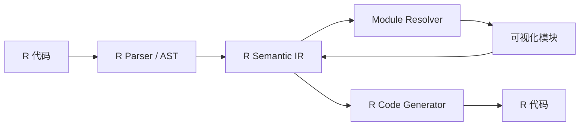
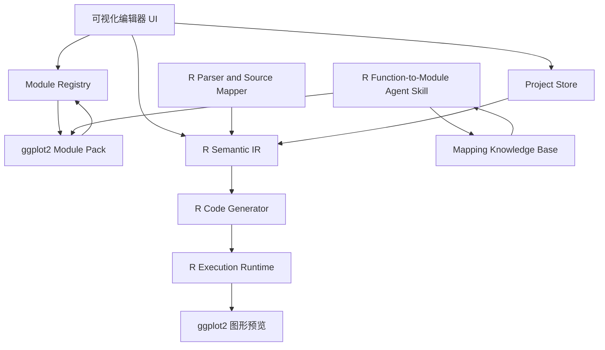

# BioPlotBlocks 开发流程与需求规范

> 项目代号：**BioPlotBlocks**（暂定）  
> 当前阶段：范围冻结、规则设计与架构验证  
> 整体语言范围：**仅限 R 语言**  
> 首期包范围：**仅限 ggplot2**  
> 首期垂直场景：**生物信息学科研绘图**

## 0. 文档说明

### 0.1 文档目的

本文档用于统一项目的产品定位、范围边界、功能要求、R 语义模型、ggplot2 模块适配规则、开发流程、测试方法、版本策略和阶段验收标准。它应作为以下工作的共同依据：

- 项目立项、范围评审和需求变更控制；
- 产品原型、交互设计和可用性测试；
- R 代码解析、生成、执行和项目持久化；
- ggplot2 函数到可视化模块的映射；
- `ModuleSpec`、R 语义中间表示和模块注册表的设计；
- Agent Skill 的设计、实现、验证和迭代；
- 生物信息学绘图模板的构建；
- 后续扩展其他 R 包时的接口与审核依据。

本文档不为其他编程语言预留交付要求，也不把多语言兼容性作为当前架构目标。未来是否支持非 R 语言，必须作为独立项目重新立项，不得反向扩大本项目首期范围。

### 0.2 规范性用语

本文使用以下术语表达约束等级：

- **必须（MUST）**：不满足即视为违反核心设计原则或验收失败；
- **应当（SHOULD）**：原则上需要满足，除非存在明确、可记录并经评审的例外；
- **可以（MAY）**：可选能力，不构成首期交付要求。

### 0.3 文档适用范围

本文覆盖：

1. 可视化编辑器；
2. R 语义中间表示、解析器、代码生成器和受控执行运行时；
3. ggplot2 首期模块包；
4. 模块描述规范 `ModuleSpec`；
5. 函数—模块映射规则；
6. 代码与模块的同步、降级和往返策略；
7. 模块开发 Agent Skill；
8. 生物信息学模板层；
9. 测试、文档、发布、兼容性和知识管理流程；
10. 后续接入其他 R 包时必须遵循的包级扩展接口。

本文不把差异表达、富集分析、单细胞分析等生物信息学计算流程纳入首期核心范围；不包含 Python、JavaScript 或其他语言的代码可视化适配。

### 0.4 v0.2 范围修订摘要

相较 v0.1，本版作出以下范围级修订：

1. **整体项目限定在 R 语言中。** 核心 IR、解析器、代码生成器和运行时可以显式利用 R 语法与语言对象，不再要求保持多语言中立。
2. **首期仅适配 ggplot2。** 首期模块库、Agent 生成范围、兼容性矩阵、用户验收和生物信息学模板均不得依赖其他 R 包。
3. **扩展轴由“语言适配”改为“R 包适配”。** 后续扩展通过新增 R Package Module Pack 完成，而不是新增 Language Adapter。
4. **其他 R 包只保留接口可扩展性，不进入首期排期。** `ggrepel`、`ggpubr`、`patchwork`、`dplyr`、`ComplexHeatmap` 等均属于后续候选，不是 MVP 依赖。
5. **模块映射知识从首个模块开始记录。** Agent Skill 不是开发末期附加功能，而是由人工映射记录、Schema、测试和审核流程逐步沉淀而成。

### 0.5 范围冻结矩阵

| 层级 | 当前决策 | 首期状态 |
|---|---|---|
| 编程语言 | 仅 R | 冻结 |
| 首期绘图包 | 仅 ggplot2 | 冻结 |
| 其他 R 包 | 架构允许后续接入，但不实现 | 排除出 MVP |
| 非 R 语言 | 不设计、不测试、不承诺 | 项目范围外 |
| 生物信息学分析流程 | 不执行分析，只可视化已有结果 | 项目范围外 |
| 代码优化或自动美化 | 不执行 | 项目范围外 |
| 函数—模块规则与 Agent Skill | 必须同步建设 | 首期交付 |

> **范围解释：**“仅限 R 语言”指被建模、解析、生成和执行的用户代码范围。界面实现可以使用 Shiny 所需的 HTML/CSS/JavaScript/TypeScript 组件，但这些技术不得成为用户代码模块或扩大代码适配范围。

# 1. 项目定义

## 1.1 一句话定义

BioPlotBlocks 是一个**限定于 R 语言、首期仅适配 ggplot2**的代码可视化模块编排系统：它将 R 函数调用、参数、符号、嵌套表达式和运算符映射为可编辑的可视化模块，并在不改变原始代码语义和 ggplot2 参数体系的前提下，生成、展示、执行和尽可能恢复对应的 R 代码。

## 1.2 项目本质

本项目不是重新发明绘图语法，也不是自动改善 ggplot2 代码。其本质是：

> 为现有 R/ggplot2 代码套一层忠实、可视化、可编辑、可追溯的交互外壳。

界面不是新的绘图语言，而是原始 R 代码的另一种表示形式。用户看到的模块、参数、嵌套关系和连接关系，都必须能够追溯到具体的 R 函数调用、实参、符号、表达式或运算符。

## 1.3 生物信息学垂直定位

生物信息学是首期应用方向，但不应写死在 R 语义核心或 ggplot2 模块机制中。垂直定位主要体现在：

- 优先适配生物信息学科研中高频使用的 ggplot2 函数；
- 用火山图、PCA/UMAP、表达比较图、富集图等真实任务验证模块组合能力；
- 提供生物信息学示例数据、教程、测试任务和用户研究；
- 形成面向科研作图的参数分组经验与模块映射案例；
- 在首期完成后，再评估其他 R 包的独立 Module Pack。

生物信息学模板必须由公开可见的 ggplot2 基础模块组合而成，不得在后台隐藏额外数据处理、统计计算或其他包调用。

## 1.4 范围层级

项目范围分为三个层级：

### 当前核心范围

- R 语法与语言对象；
- R 代码解析、生成、执行和保存；
- R 函数到可视化模块的通用映射机制；
- R 包级模块注册和版本管理。

### 首期实现范围

- ggplot2 函数模块；
- ggplot2 的 `+` 组合语义；
- `ggplot()`、`aes()`、常用 `geom_*()`、尺度、分面、标签和主题函数；
- 单个 ggplot 对象表达式及可选赋值；
- ggplot2 生物信息学组合模板。

### 首期之后的候选范围

- 其他 R 绘图包或 ggplot2 扩展包；
- R 数据处理包；
- 更复杂的 R 表达式与元编程支持。

候选范围不构成承诺，只有在首期验收通过并形成稳定的包级扩展合同后，才能进入新版本计划。

## 1.5 产品责任边界

系统负责：

- 把受支持的 R/ggplot2 代码结构可视化；
- 让用户通过模块编辑真实函数和参数；
- 生成可运行、可审计的 R 代码；
- 对语法、参数和兼容性问题给出提示；
- 保留无法结构化的合法 R 表达式；
- 记录模块映射来源、版本和测试证据。

系统不负责：

- 判断图形选择是否科学；
- 判断统计方法是否正确；
- 自动优化代码、图层、主题或配色；
- 自动补充缺失的数据处理；
- 自动执行生物信息学分析；
- 将其他 R 包功能伪装成 ggplot2 原生功能。

# 2. 核心原则

## 2.1 原则一：整体限定 R，首期仅实现 ggplot2

本项目当前只面向 R 语言。核心语义模型可以显式建模 R 的以下概念：

- R 函数调用和语言对象；
- 命名与未命名实参；
- 缺失参数；
- 符号、字面量和特殊常量；
- 公式；
- 运算符调用；
- 命名空间访问；
- 非标准求值相关表达式；
- 源代码位置、注释和原始文本；
- R 包、R 版本和包版本约束。

首期只实现 ggplot2 Module Pack。核心代码不得依赖某个具体 `geom_*()` 名称，但可以依赖 R 语言语义。后续扩展的单位是“其他 R 包”，而不是“其他编程语言”。

应采用“可扩展但不预实现”的策略：

- 核心注册表允许未来加载其他 R Package Module Pack；
- 首期不得为未确定的其他语言设计抽象；
- 首期不得因预想其他 R 包而增加没有实际用例的复杂层；
- 新抽象必须由 ggplot2 真实需求或至少一个已批准的 R 包扩展需求驱动。

## 2.2 原则二：忠实表示代码，不改善代码本身

系统必须遵守以下边界：

- 不自动重构用户代码；
- 不自动改变函数；
- 不自动修改参数值；
- 不自动替换“更优”的绘图方案；
- 不自动添加统计检验、配色、标签、主题或数据处理；
- 不自动改变图层顺序；
- 不因界面限制而静默丢弃表达式；
- 不以“优化”“纠错”或“推荐”为由改变代码语义。

系统可以提供以下非侵入能力：

- R 语法错误提示；
- ggplot2 参数、弃用和版本兼容提示；
- 参数类型或推荐范围提示；
- ggplot2 原始错误、警告和消息展示；
- 不改变语义的代码格式化；
- 用户主动触发的模板插入或模块替换；
- 用户主动接受后才执行的迁移操作。

任何可能改变代码语义的操作都必须由用户显式触发，并在执行前展示差异。项目首先保证**语义保真**，不承诺首期实现逐字符文本保真。

## 2.3 原则三：参数与目标版本的 ggplot2 保持一致

模块参数的名称、来源、默认值、语义和约束，必须以目标版本的 ggplot2 真实函数对象、官方文档和实际执行结果为依据。

“常用设置”和“高级设置”只是一种界面分组，不得改变：

- 参数真实名称；
- 参数是否存在；
- 参数默认值；
- 参数进入函数调用的方式；
- 参数值的 R 类型；
- `...` 的传递语义；
- 代码生成结果；
- 原函数对参数的解释。

系统不得创造与 ggplot2 不一致的伪参数。为了交互而设计的复合控件，必须能够展开为一个或多个真实参数，并显示对应的 R 代码。

## 2.4 原则四：沉淀“R 函数—可视化模块”映射知识

每次将一个 R 函数映射为可视化模块时，必须记录：

- R 版本、包名、包版本和函数来源；
- 函数签名与导出状态；
- 正式参数、缺失参数和 `...` 的去向；
- 参数值类型和特殊 R 语义；
- 常用/高级分组依据；
- 控件选择依据；
- 组合上下文与返回对象；
- 代码生成和解析规则；
- 示例、边界案例和失败案例；
- 无法自动映射的部分；
- 人工决策、证据和审核结论；
- 目标版本的实际执行与往返测试结果。

这些知识最终必须统一为：

1. 一套机器可读的 `ModuleSpec`；
2. 一套 R 函数映射规则；
3. 一套 ggplot2 特殊语义规则；
4. 一套模块开发检查清单；
5. 一套可供 Agent 执行的 Skill；
6. 一套自动验证、人工审核和版本发布流程。

## 2.5 原则五：不支持的 R 表达式必须可降级保留

可视化能力不足不得成为删除或改写合法 R 代码的理由。无法可靠结构化的表达式必须降级为 `RawExpression`、Raw R 参数值或只读代码片段，并保留：

- 原始文本；
- 源代码位置；
- 所属参数或组合位置；
- 解析失败原因；
- 是否允许编辑和执行；
- 再次解析所需的版本信息。

降级必须显式可见，不得伪装成已完整支持。

## 2.6 原则六：模块必须声明式、可测试、可版本化

新增普通 ggplot2 函数模块应主要通过 ModuleSpec、映射记录和测试加入，而不是修改核心编辑器。每个模块必须绑定：

- 模块定义版本；
- ModuleSpec Schema 版本；
- R 兼容范围；
- ggplot2 兼容范围；
- 映射规则版本；
- 测试用例和快照；
- 稳定性等级；
- 变更记录和审核状态。

# 3. 项目目标与非目标

## 3.1 首期目标

首期项目应实现以下结果：

1. 将受支持的 ggplot2 代码展示为可编辑模块；
2. 从可视化模块稳定生成可运行的 R/ggplot2 代码；
3. 参数面板保持目标 ggplot2 版本的原始参数体系；
4. 支持常用参数与高级参数分组，并允许查看全部原生参数；
5. 正确区分未设置、显式默认、`NULL`、`NA`、符号、字符串和表达式；
6. 支持一个 ggplot 对象表达式、可选赋值和 `+` 图层链；
7. 不可识别表达式能够无损降级保留；
8. 模块由声明式 ModuleSpec 驱动，而不是逐个手写界面；
9. 软件自身生成的受支持代码能够稳定往返；
10. 至少形成一个可重复执行的 ggplot2 函数模块 Agent Skill 原型；
11. 提供若干只依赖 ggplot2 的生物信息学模板；
12. 建立可复用的测试、版本、文档和人工审核流程。

## 3.2 明确非目标

首期不追求：

- 替代 RStudio、Positron 或完整 R IDE；
- 支持任意 R 程序的完整可视化；
- 支持多个图形对象之间的复杂脚本控制流；
- 自动优化、重构或美化代码；
- 自动判断图形、统计或科研结论是否正确；
- 自动完成生物信息学分析；
- 支持全部 ggplot2 函数、全部参数组合和全部元编程场景；
- 将 `ggrepel`、`ggpubr`、`patchwork`、`cowplot`、`dplyr`、`ComplexHeatmap` 等其他 R 包作为首期一等模块；
- 完整还原所有手写 R 代码的排版、注释和编程风格；
- 支持 Python、JavaScript 或任何非 R 语言；
- 设计通用多语言 AST、运行时或插件系统；
- 运行任意不受限制的用户代码；
- 在线多人协作；
- 云端长期托管科研数据。

## 3.3 首期完成判定

首期成功不以模块数量最大化为目标，而以以下链路是否可靠为判断依据：

```text
真实 ggplot2 函数与文档
→ 映射记录
→ ModuleSpec
→ 参数界面
→ R 语义 IR
→ R 代码生成
→ 真实 ggplot2 执行
→ 解析与往返测试
→ 人工审核
```

只要该链路稳定，后续扩展其他 R 包才有实际基础。

# 4. 用户与典型使用场景

## 4.1 核心用户

### A. 生物信息学学生

需求：通过模块理解 ggplot2 的函数组成和参数含义，同时获得可继续学习和修改的真实 R 代码。

### B. 科研绘图用户

需求：快速组合已有 ggplot2 函数，减少查找参数和反复试写的成本，但保留完整代码与可复现性。

### C. 模块开发者

需求：根据统一规则，将新的 ggplot2 函数映射为模块，而不必重写整个前端。

### D. ggplot2 模块维护者

需求：基于 `ModuleSpec + Agent Skill` 为尚未适配的 ggplot2 函数生成初始模块定义，再进行人工审核和发布。其他 R 包维护者属于首期之后的潜在用户。

## 4.2 典型流程

### 场景一：从模块生成代码

```text
打开项目
→ 选择数据或示例数据
→ 添加 ggplot 模块
→ 添加 aes 模块
→ 添加 geom_point 模块
→ 设置常用参数
→ 展开高级参数
→ 查看实时代码
→ 执行预览
→ 导出 R 脚本或保存项目
```

### 场景二：从受支持代码恢复模块

```text
粘贴 R/ggplot2 代码
→ 解析 AST
→ 识别函数、参数和 + 组合
→ 生成模块链
→ 不可识别部分转为 Raw R Expression
→ 用户继续编辑
→ 再次生成代码
```

### 场景三：基于模板开始

```text
选择“火山图”模板
→ 系统插入公开可见的 ggplot2 模块组合
→ 用户替换数据列映射
→ 修改各函数原生参数
→ 查看代码与图形
```

### 场景四：生成新模块

```text
开发者指定 ggplot2 函数、R 版本和 ggplot2 版本
→ Agent 读取锁定环境中的函数签名与文档
→ 生成 ModuleSpec 草案
→ 生成测试与映射说明
→ 自动验证
→ 人工审核
→ 加入模块注册表
```

---

# 5. 核心术语

| 术语 | 定义 |
|---|---|
| Visual Module | 一个 R 代码实体的可视化表示，通常对应函数调用、运算符、符号或表达式 |
| ModuleSpec | 描述模块身份、R 包来源、参数、控件、组合规则、版本、证据和测试要求的声明式规范 |
| R Semantic IR | 代码视图与模块视图共享的 R 语义中间表示，不直接等同于界面或文本代码 |
| R Parser | 将 R 源代码解析为语法树、源位置和 R Semantic IR 的组件 |
| R Code Generator | 将 R Semantic IR 确定性地生成 R 代码的组件 |
| R Execution Runtime | 在明确环境和安全边界下执行生成代码并返回 ggplot 对象、错误、警告和版本信息的组件 |
| Package Module Pack | 某个 R 包的一组 ModuleSpec、组合规则、文档和测试；首期只有 ggplot2 Module Pack |
| Raw Expression | 无法可靠进一步结构化但必须无损保留的 R 表达式 |
| Common Settings | 界面默认展示的常用原生参数，不改变底层语义 |
| Advanced Settings | 默认折叠的其他原生参数、`...` 和复杂表达式设置 |
| Round-trip | 代码到模块再回到代码，或模块到代码再回到模块的语义往返转换 |
| Template | 一组预先组合的普通 ggplot2 模块，不得包含隐藏逻辑 |
| Mapping Record | 记录 R 函数到模块映射过程、证据、例外、版本和测试结果的知识文档 |
| Stability Level | 模块的 draft、experimental、beta、stable、deprecated 或 unsupported 状态 |

# 6. 产品功能需求

## 6.1 工作区

系统必须提供统一工作区，至少包含：

1. 模块库；
2. 模块画布或图层编排区；
3. 参数设置区；
4. R 代码视图；
5. 图形预览区；
6. 错误、警告和包版本信息区。

推荐布局：

```text
┌──────────────┬────────────────────────┬──────────────────┐
│ 模块库       │ 模块/图层编排区        │ 参数面板         │
│              │                        │                  │
│ Core         │ ggplot(data = df)      │ 常用设置         │
│ ggplot2      │          +             │ 高级设置         │
│ Templates    │ geom_point(...)        │ 参数文档         │
│ Raw R        │          +             │ 参数来源         │
│              │ theme_classic()        │ 代码表达式模式   │
├──────────────┴────────────────────────┴──────────────────┤
│ 图形预览                         │ R 代码视图            │
└──────────────────────────────────────────────────────────┘
```

## 6.2 模块库

模块库必须支持：

- 按 R 包、模块类别和稳定性筛选；
- 按函数名、别名和文档关键词搜索；
- 显示函数所属包和兼容版本；
- 显示模块是否稳定、实验性或已弃用；
- 将模块拖入或点击加入编排区；
- 查看模块说明、示例和来源；
- 区分函数模块、运算符模块、表达式模块和模板。

模块库不应将模板和函数模块混为同一层级。模板是一组模块的组合入口。

## 6.3 模块编排

模块编排区必须支持：

- 添加、删除、复制模块；
- 拖动排序；
- 展开或折叠模块；
- 选择当前模块；
- 显示函数全名和包名；
- 显示关键参数摘要；
- 显示组合运算符；
- 显示嵌套模块；
- 对不合法连接提供即时提示；
- 保留不可识别表达式；
- 撤销和重做；
- 模块与代码位置同步高亮。

首版可以使用“线性图层栈 + 嵌套参数槽”的交互，不必一开始实现无限画布式节点图。

## 6.4 参数面板

参数面板必须：

- 使用原函数参数名；
- 展示参数来源：正式参数、`...`、派生美学参数或嵌套表达式；
- 区分一般设置（常用）、高级设置和“显示全部参数”视图；
- 展示原始默认值；
- 区分“未设置”和“显式设为默认值”；
- 支持切换图形控件输入和原始 R 表达式输入；
- 展示参数帮助和文档来源；
- 对约束进行提示，但不得静默修正；
- 显示当前参数会生成的代码片段。

## 6.5 代码视图

代码视图必须支持：

- 实时显示模块对应的 R 代码；
- 基础语法高亮；
- 模块和代码双向定位；
- 复制代码；
- 导出 `.R` 文件；
- 显示代码生成警告；
- 切换“精简代码”和“显式参数代码”视图；
- 显示是否包含无法结构化的 Raw Expression；
- 在受支持范围内重新解析用户编辑的代码。

首版不要求实现任意自由代码编辑后的完全无损回写。若启用代码编辑，必须清晰标注支持范围和解析结果。

## 6.6 图形预览

图形预览必须：

- 使用实际 R/ggplot2 执行结果，而不是另一个绘图库近似模拟；
- 展示执行错误、警告和消息；
- 不隐藏由 R 包产生的错误；
- 支持手动刷新和可选自动刷新；
- 对耗时执行提供取消能力；
- 记录执行所用 R 与包版本；
- 支持常用尺寸与分辨率预览。

## 6.7 项目保存与恢复

项目文件必须保存：

- IR；
- 模块实例及顺序；
- 每个参数的状态和值；
- 数据引用方式；
- R 版本、ggplot2 版本及模块定义版本信息；
- 模块规范版本；
- 原始表达式；
- 模板来源；
- 可选的预览设置；
- 可选的代码格式设置。

项目文件应采用版本化 JSON 或等价结构，并提供迁移机制。

## 6.8 模板系统

模板必须满足：

- 由普通模块组成；
- 展开后全部函数调用可见；
- 不执行隐藏数据处理；
- 不改变模块的原生参数；
- 可保存为用户模板；
- 可标注适用数据结构，但不把模板误称为统计分析方法。

首期生物信息学模板可包括：

- 火山图基础模板；
- PCA/UMAP 散点图模板；
- 表达箱线图/小提琴图模板；
- 富集气泡图模板；
- 其他只依赖 ggplot2 的组合模板。

首期模板不得依赖 `patchwork`、`ggrepel`、`ggpubr`、`dplyr` 或其他附加 R 包。

## 6.9 Raw R 模块

系统必须提供 Raw R 模块或等价能力，用于保留无法结构化的表达式，例如：

```r
geom_point(size = calculate_size(config))
```

其中 `calculate_size(config)` 应保存为表达式，而不是字符串。

Raw R 模块必须：

- 保留原始代码；
- 标记其无法由图形控件完整编辑；
- 允许用户查看和修改；
- 参与代码生成；
- 在安全执行策略允许时参与预览；
- 不被系统静默删除或替换。

---

# 7. 参数体系要求

## 7.1 参数权威来源

参数信息按以下优先级确定：

1. 锁定环境中目标版本的真实函数对象与函数签名；
2. 同一安装版本附带的官方帮助页和 Rd 文档；
3. 同版本命名空间、源码、Geom/Stat/Layer 对象或导出对象；
4. 同版本官方 vignettes 和示例；
5. 目标环境中的实际执行与探测结果；
6. 有证据记录的人工映射决策。

首期“目标包”即 ggplot2。后续其他 R Package Module Pack 必须重新建立自己的证据链。

第三方教程不得作为参数定义的唯一依据。

## 7.2 参数状态模型

系统必须区分至少以下状态：

| 状态 | 示例 | 含义 |
|---|---|---|
| unset | 未出现 `alpha` | 不生成该参数，交给函数默认机制 |
| explicit | `alpha = 0.5` | 用户显式设置 |
| explicit_default | `na.rm = FALSE` | 显式写出等于当前默认值的参数 |
| explicit_null | `data = NULL` | 显式传入 `NULL` |
| explicit_na | `show.legend = NA` | 显式传入 `NA` |
| raw_expression | `size = f(x)` | 参数值为原始 R 表达式 |
| inherited | 由全局映射继承 | 非本模块显式参数，但影响当前层 |

`unset` 与 `explicit_default` 不得合并，因为包版本变化或函数内部判断可能使其产生不同结果。

## 7.3 参数值类型

首期类型系统至少支持：

- 字符串；
- 数值与整数；
- 逻辑值；
- `NULL`；
- `NA` 及带类型的 NA；
- `Inf`、`-Inf`、`NaN`；
- 符号或列引用；
- 命名参数；
- 向量；
- 列表；
- 公式；
- 函数引用；
- 函数调用；
- `aes()` 映射；
- 颜色值；
- 枚举值；
- 原始 R 表达式。

## 7.4 一般设置（常用）、高级设置与全部参数

参数分组仅影响界面默认展示。分组依据应记录在 ModuleSpec 中。

- **一般设置（常用）**：默认展开，展示高频且适合直接操作的原生参数；
- **高级设置**：默认折叠，展示其余原生参数、复杂参数和 `...`；
- **全部参数**：审计视图，用于检查模块已覆盖的所有参数来源及其当前状态。

推荐判定标准：

1. 是否出现在官方文档的主签名或首屏说明；
2. 是否在典型使用中高频出现；
3. 是否对图形外观或核心映射有直接影响；
4. 是否适合用简单控件表达；
5. 是否容易被初学者理解；
6. 是否不会因默认展示造成明显认知负担。

常用参数数量应保持克制。一般建议每个模块默认展示 4—10 个常用项，其余放入高级设置。

任何参数都应能通过高级设置、全部参数视图或原始表达式模式访问；不得因分组而永久隐藏。

“全部参数”视图不得默认把所有未设置参数写入生成代码；它只负责可见性与审计。

## 7.5 控件映射

常见控件可按以下规则生成：

| 参数语义 | 默认控件 | 备用模式 |
|---|---|---|
| logical | 三态/四态选择器 | R 表达式 |
| enum | 下拉框 | R 表达式 |
| number | 数值输入 | R 表达式 |
| bounded number | 数值输入 + 范围提示 | R 表达式 |
| color | 颜色选择器 | 字符串或表达式 |
| symbol/column | 数据列选择器 | R 表达式 |
| formula | 公式编辑器 | R 表达式 |
| vector | 可增删列表 | R 表达式 |
| function | 函数选择/文本输入 | R 表达式 |
| aes mapping | 映射编辑器 | `aes(...)` 表达式 |
| arbitrary expression | 代码输入框 | 无 |

控件约束用于减少输入错误，不得将非法值自动改成另一个值。系统应提示并由用户决定。

## 7.6 `...` 参数

R 包常通过 `...` 接收额外参数。系统必须记录参数来源：

- `formal`：正式形参；
- `dots_documented`：文档中明确列出的 `...` 参数；
- `dots_aesthetic`：通过 `...` 接收的固定美学属性；
- `dots_forwarded`：转发给其他函数；
- `dots_unknown`：无法确定。

对于 `dots_unknown`，系统应提供任意命名参数编辑器，并将其标记为高级能力。

---

# 8. R 语义中间表示（R Semantic IR）

## 8.1 定位与设计目标

R Semantic IR 是代码视图、模块视图、项目文件、代码生成器和解析器共享的唯一语义来源。系统不得以不可追踪的字符串拼接作为模块状态的主要表示。

本项目已经限定在 R 语言中，因此 IR 不追求语言中立，而应准确表达首期所需的 R 语义。IR 必须满足：

- 能表达首期支持的 R/ggplot2 语法；
- 能区分 R 的符号、字符串、缺失参数、`NULL`、各类 `NA` 和其他特殊常量；
- 能表达命名与未命名实参；
- 能表达嵌套函数、公式和运算符链；
- 能记录参数是否显式设置；
- 能保留无法理解的 R 表达式；
- 能记录源代码范围、注释和原始文本片段；
- 能映射到 ModuleSpec；
- 能支持确定性代码生成、解析和往返测试；
- 能进行版本化和项目迁移。

## 8.2 推荐节点类型

首期建议至少包含：

```text
RProgram
├── RAssignment
├── RExpressionStatement
├── RCall
├── RArgument
├── RMissingArgument
├── RSymbol
├── RNamespaceReference
├── RLiteral
│   ├── RCharacter
│   ├── RDouble
│   ├── RInteger
│   ├── RLogical
│   ├── RNull
│   ├── RNA / typed NA
│   ├── RInf
│   └── RNaN
├── RFormula
├── ROperatorExpression
├── RParenthesizedExpression
├── RRawExpression
├── RComment
└── RSourceRange
```

首期可以把向量、列表、索引、成员访问和部分特殊调用表示为普通 `RCall` 或 `ROperatorExpression`。只有当真实需求反复出现时，才增加专用节点。

## 8.3 参数状态模型在 IR 中的表达

每个 `RArgument` 至少记录：

```text
name              参数名，可为空
position          原始位置
state             unset / explicit / explicit_default /
                  explicit_null / explicit_na / raw_expression /
                  missing / inherited
value             R 表达式节点
source_range      原代码范围
source_text       可选原始文本
origin            formal / dots_documented / dots_aesthetic /
                  dots_forwarded / dots_unknown
```

`unset` 通常不作为实际调用实参写入 AST，但必须存在于模块实例状态中；`missing` 则表示 R 调用中真实存在的缺失实参，两者不得混淆。

## 8.4 示例

原始代码：

```r
p <- ggplot(df, aes(x = group, y = value)) +
  geom_boxplot(outlier.shape = NA) +
  geom_jitter(width = 0.15, alpha = 0.6) +
  theme_classic()
```

简化 IR：

```json
{
  "type": "RAssignment",
  "operator": "<-",
  "target": {"type": "RSymbol", "name": "p"},
  "value": {
    "type": "ROperatorExpression",
    "operator": "+",
    "associativity": "left",
    "items": [
      {
        "type": "RCall",
        "namespace": null,
        "function": "ggplot",
        "arguments": [
          {
            "name": "data",
            "state": "explicit",
            "value": {"type": "RSymbol", "name": "df"}
          },
          {
            "name": "mapping",
            "state": "explicit",
            "value": {
              "type": "RCall",
              "function": "aes",
              "arguments": [
                {"name": "x", "value": {"type": "RSymbol", "name": "group"}},
                {"name": "y", "value": {"type": "RSymbol", "name": "value"}}
              ]
            }
          }
        ]
      },
      {
        "type": "RCall",
        "function": "geom_boxplot",
        "arguments": [
          {
            "name": "outlier.shape",
            "state": "explicit_na",
            "value": {"type": "RNA", "na_type": "logical"}
          }
        ]
      },
      {
        "type": "RCall",
        "function": "geom_jitter",
        "arguments": [
          {"name": "width", "state": "explicit", "value": {"type": "RDouble", "value": 0.15}},
          {"name": "alpha", "state": "explicit", "value": {"type": "RDouble", "value": 0.6}}
        ]
      },
      {
        "type": "RCall",
        "function": "theme_classic",
        "arguments": []
      }
    ]
  }
}
```

## 8.5 R 特殊语义的处理边界

首期不要求完整模拟 R 的运行时语义。以下内容应分级处理：

- tidy evaluation；
- quosure 和环境捕获；
- `.data[[...]]`、`.env[[...]]`；
- `!!`、`!!!`、`{{ }}`；
- S3/S4 方法分派；
- promise 和延迟求值；
- 动态生成调用；
- 用户自定义运算符；
- 公式环境；
- 宏式元编程。

若解析器能够识别外层结构，但不能安全理解内部语义，应把内部表达式保存为 `RRawExpression`。系统不得通过猜测把它简化为错误的普通值。

## 8.6 源代码保真策略

项目区分两种保真：

- **语义保真：必须。** 函数、参数状态、表达式和组合关系不得被无意改变。
- **文本保真：首期有限支持。** 空格、换行、非关键括号和部分注释位置可以变化。

为降低损失，IR 应尽可能记录 `source_range`、`source_text` 和注释绑定。Raw Expression 必须优先保留原始文本。

## 8.7 IR 扩展规则

新增 IR 节点必须满足至少一个条件：

1. ggplot2 首期功能无法用现有节点可靠表达；
2. 同类 Raw Expression 已在多个模块中反复出现；
3. 新节点能够显著改善往返稳定性或错误定位；
4. 有明确测试、迁移方案和 ADR。

不得仅为未来可能支持的非 R 语言增加节点。

# 9. ModuleSpec 模块描述规范

## 9.1 设计目标

ModuleSpec 是模块注册、参数面板、代码生成、代码解析、文档、测试、版本管理和 Agent 产物的统一来源。

模块不应通过大量硬编码前端页面实现。前端应尽可能根据 ModuleSpec 自动构建界面；确需自定义控件时，也必须由 ModuleSpec 声明并保留 Raw Expression 退路。

本项目固定运行时为 R。ModuleSpec 中的 `runtime: R` 用于校验和溯源，不是多语言扩展点。扩展维度是 `package` 和包级规则。

## 9.2 顶层字段

建议至少包含：

```text
schema_version
module_version
id
runtime
r_version
package
package_version
symbol
exported
module_type
status
presentation
composition
parameters
code_generation
code_parsing
documentation
examples
compatibility
provenance
tests
review
```

关键约束：

- `runtime` 必须为 `R`；
- 首期 `package` 必须为 `ggplot2`，核心与 Raw 模块除外；
- `package_version` 必须引用在 M0 冻结的兼容性矩阵，不得随开发机器隐式漂移；
- 每个参数必须记录来源、状态、允许值类型、UI 分组和 Raw Expression 策略；
- 每个稳定模块必须有真实执行和往返测试证据。

## 9.3 示例

以下版本字段为结构示例，实际兼容范围必须在 M0 通过锁定环境确定：

```yaml
schema_version: 0.2.0
module_version: 0.1.0
id: r.ggplot2.geom_point
runtime: R
r_version: "${SUPPORTED_R_RANGE}"
package: ggplot2
package_version: "${SUPPORTED_GGPLOT2_RANGE}"
symbol: geom_point
exported: true
module_type: r_function_call
status: experimental

presentation:
  title: Point layer
  title_zh: 散点图层
  category: geom
  icon: point
  summary: Add a point geometry layer

composition:
  output_type: ggplot_component
  accepted_contexts:
    - ggplot_plus_chain
  operator: "+"
  multiplicity: many

parameters:
  - name: mapping
    source: formal
    formal_default:
      type: RNull
    value_types:
      - aes_mapping
      - r_null
      - r_expression
    ui_group: common
    ui_control: aes_editor
    raw_expression_allowed: true
    omit_when_unset: true

  - name: data
    source: formal
    formal_default:
      type: RNull
    value_types:
      - data_reference
      - r_function
      - r_null
      - r_expression
    ui_group: advanced
    ui_control: data_reference_or_expression
    raw_expression_allowed: true
    omit_when_unset: true

  - name: colour
    aliases:
      - color
    source: dots_aesthetic
    value_types:
      - color_literal
      - r_character
      - r_vector
      - r_expression
    ui_group: common
    ui_control: color_or_expression
    raw_expression_allowed: true
    omit_when_unset: true

  - name: size
    source: dots_aesthetic
    value_types:
      - r_number
      - r_vector
      - r_expression
    ui_group: common
    ui_control: numeric_or_expression
    raw_expression_allowed: true
    omit_when_unset: true

  - name: alpha
    source: dots_aesthetic
    value_types:
      - r_number
      - r_vector
      - r_expression
    ui_group: common
    ui_control: numeric_or_expression
    constraints:
      recommended_minimum: 0
      recommended_maximum: 1
      enforcement: warn_only
    raw_expression_allowed: true
    omit_when_unset: true

  - name: na.rm
    source: formal
    formal_default:
      type: RLogical
      value: false
    value_types:
      - r_logical
      - r_expression
    ui_group: advanced
    ui_control: logical_state
    raw_expression_allowed: true
    omit_when_unset: true

code_generation:
  call_style: preserve_or_named
  namespace_policy: project_setting
  preserve_argument_order: true
  omit_unset_parameters: true
  preserve_explicit_defaults: true
  support_raw_expressions: true

code_parsing:
  accepted_symbols:
    - geom_point
    - ggplot2::geom_point
  unknown_arguments: preserve_as_named_raw
  unknown_values: preserve_as_raw_expression

compatibility:
  runtime: R
  required_context: ggplot_plus_chain
  output_type: ggplot_component

documentation:
  reference_topic: geom_point
  source_type: installed_package_help

provenance:
  generated_by: manual_agent_hybrid
  source_environment_lock: renv.lock
  mapping_rule_version: 0.2.0
  reviewed: false

tests:
  required:
    - schema
    - codegen
    - parser
    - roundtrip
    - execution
```

## 9.4 模块类型

首期至少支持：

- `r_function_call`：普通 R 函数调用；
- `r_nested_call`：参数槽中的嵌套函数调用；
- `r_operator`：如 ggplot2 使用的 `+`；
- `r_literal`：R 数值、字符串、逻辑、`NULL`、`NA` 等；
- `r_symbol_reference`：变量或列符号引用；
- `r_formula`：公式表达式；
- `r_raw_expression`：原始 R 表达式；
- `template`：可展开的模块组合模板；
- `container`：可选，用于组织图层链或复合参数。

首期不得增加仅为其他编程语言服务的模块类型。

## 9.5 参数定义的最小字段

每个参数定义至少应包含：

```text
name
source
formal_default
value_types
ui_group
ui_control
raw_expression_allowed
omit_when_unset
help_source
version_notes
```

对于来自 `...` 的参数，还必须记录：

- 文档证据；
- 转发目标；
- 是否为 aesthetic；
- 是否只在特定 `stat`、`geom` 或上下文中有效；
- 未知命名参数的保留策略。

## 9.6 规范版本

ModuleSpec 必须有独立的 `schema_version`。应用版本、模块定义版本、R 版本和 ggplot2 兼容版本必须分开管理。

示例：

```text
Application: 0.2.0
Project/IR schema: 0.2.0
ModuleSpec schema: 0.2.0
geom_point module: 0.1.0
R compatibility: compatibility-matrix.yaml
ggplot2 compatibility: compatibility-matrix.yaml
```

## 9.7 自定义控件限制

自定义控件必须：

- 有明确的真实参数映射；
- 不隐藏额外函数调用；
- 不改变默认值；
- 支持切回原始 R 表达式；
- 有独立测试；
- 在 ModuleSpec 中声明使用原因。

# 10. “R 函数—可视化模块”统一映射规则

## 10.1 基本规则

### 规则 1：一个 R 函数调用默认对应一个函数模块

```r
geom_point(...)
```

对应：

```text
[ggplot2::geom_point]
```

不得为了界面便利，把一个函数拆成多个无法对应真实代码的伪模块。复合控件可以存在，但必须明确其真实参数映射。

### 规则 2：函数实参对应模块属性

```r
geom_point(size = 3, alpha = 0.5)
```

对应：

```text
geom_point
├── size = 3
└── alpha = 0.5
```

每个属性必须记录参数名、原始位置、状态、值类型和来源。

### 规则 3：嵌套函数对应嵌套模块或表达式槽

```r
ggplot(df, aes(x = group, y = value))
```

对应：

```text
ggplot
├── data = df
└── mapping
    └── aes
        ├── x = group
        └── y = value
```

如果嵌套函数没有对应首期模块，应保留为结构化 R 调用或 Raw Expression，而不是转成字符串。

### 规则 4：运算符对应真实 R 组合关系

```r
ggplot(...) + geom_point() + theme_classic()
```

其中 `+` 必须作为 R 运算符调用建模，并记录结合方向和源位置。首期只承诺 ggplot2 使用的 `+` 组合，不实现其他包的运算符语义。

### 规则 5：符号引用与字符串常量必须区分

```r
aes(color = group)
```

`group` 是符号或列引用。

```r
geom_point(color = "red")
```

`"red"` 是字符串常量。

内部类型、控件和代码生成必须区分二者。

### 规则 6：映射参数与固定参数必须区分

```r
ggplot(df, aes(color = group)) + geom_point()
```

与：

```r
ggplot(df) + geom_point(color = "red")
```

不得合并。系统应分别显示：

- `aes()` 中的数据映射；
- `geom_*()` 中的固定 aesthetic；
- 图层局部 `mapping`；
- 全局映射与 `inherit.aes`；
- 当前层的只读有效映射。

### 规则 7：未设置、缺失和显式默认必须区分

用户没有设置 `na.rm` 时，应生成：

```r
geom_point()
```

而不是：

```r
geom_point(na.rm = FALSE)
```

系统还必须区分：

- 模块状态中的 `unset`；
- R 调用中的缺失实参；
- 显式 `NULL`；
- 显式 `NA`；
- 显式写出的当前默认值。

### 规则 8：R 特殊常量必须保留类型

以下值不得统一当作字符串：

```r
NULL
NA
NA_integer_
NA_real_
NA_character_
TRUE
FALSE
Inf
-Inf
NaN
1L
```

代码生成必须恢复正确的 R 语法和类型。

### 规则 9：命名与未命名实参及顺序必须保留

```r
foo(x, y = 2)
```

第一个实参是未命名位置参数，第二个是命名参数。系统不得在不确认语义的情况下重新命名或重排。新插入参数可以按函数签名或 ModuleSpec 规定顺序添加，但必须生成确定性结果。

### 规则 10：未知表达式必须无损降级

```r
scale_color_manual(values = palette_function(groups))
```

即使无法进一步可视化 `palette_function(groups)`，也必须保留为 R 表达式，不能字符串化、删除或用占位值替代。

### 规则 11：命名空间策略可配置但不得改变目标函数

系统应支持：

```r
geom_point()
```

和：

```r
ggplot2::geom_point()
```

项目应记录命名空间策略：

- 保留输入风格；
- 始终使用 `ggplot2::`；
- 假设脚本已加载 `library(ggplot2)`；
- 导出完整脚本时生成包加载语句。

### 规则 12：公式、调用和其他 R 表达式优先保持原生结构

例如：

```r
facet_wrap(~ group)
geom_smooth(formula = y ~ poly(x, 2))
```

公式不得被当作普通字符串。若专用控件无法完整表达，应切换为公式或 Raw Expression 编辑模式。

### 规则 13：模板必须展开为真实 ggplot2 模块

“火山图”“PCA 图”等模板不是隐藏函数。插入模板后，用户必须看到其包含的 `ggplot()`、`aes()`、`geom_*()`、`scale_*()`、`labs()` 和 `theme_*()` 调用。

### 规则 14：模块不得隐式调用其他附加 R 包

首期模块若对应 `ggplot2::geom_point()`，其实现不得在后台额外调用 `dplyr`、`ggrepel`、`ggpubr` 或其他包。任何非 ggplot2 调用都必须在首期被拒绝、保留为 Raw R，或明确标记为超出支持范围。

## 10.2 默认值处理

默认值可能是：

- 常量；
- R 表达式；
- `NULL`；
- 缺失参数；
- 由内部函数动态决定；
- 随 R 或 ggplot2 版本变化。

ModuleSpec 必须同时记录：

- 目标环境中观察到的函数签名默认值；
- 默认值的原始 R 表达式；
- 是否安全用于普通 UI 展示；
- 是否建议用户显式设置；
- 版本差异。

系统不得把复杂默认表达式简化为错误的静态值。

## 10.3 已弃用参数与别名

对于已弃用参数或拼写别名：

- 必须标记目标 ggplot2 版本；
- 应显示官方弃用警告；
- 不得自动替换为新参数，除非用户主动确认；
- 解析旧代码时应尽可能保留；
- ModuleSpec 可以记录替代建议，但默认代码生成不得改写；
- `colour`/`color` 等受支持别名必须记录规范输出策略和输入保留策略。

## 10.4 `...` 与动态参数

如果参数通过 `...` 接收或转发，自动映射工具必须：

- 识别文档明确列出的参数；
- 记录其转发目标；
- 区分 aesthetic、layer、geom、stat 或未知参数；
- 对未知命名参数提供 Raw named argument 编辑器；
- 增加真实执行测试；
- 不宣称自动映射完整。

## 10.5 映射置信度

每个参数或规则应允许记录置信度：

- `verified_runtime`：由目标环境实际对象或执行验证；
- `verified_documentation`：由同版本官方文档验证；
- `inferred`：根据规则推断，待人工确认；
- `manual_override`：人工审查后覆盖自动推断；
- `unknown`：不得自动生成普通控件。

# 11. ggplot2 首期适配要求

## 11.1 首期支持单元

首期处理的基本代码单元是：

```text
一个可选赋值
+ 一个 ggplot 对象表达式
+ 一个或多个 ggplot2 组件的 + 链
```

例如：

```r
p <- ggplot(df, aes(x, y)) +
  geom_point() +
  labs(title = "Example") +
  theme_classic()
```

首期不把完整 R 脚本、循环、条件分支、函数定义或多个对象之间的控制流作为可视化单位。

## 11.2 首期支持语法子集

### R 外层语法

- 可选赋值：优先支持 `<-`；
- R 函数调用；
- 命名与未命名实参；
- `ggplot2::function` 命名空间形式；
- 基础字面量、符号、公式和 Raw Expression；
- ggplot2 的 `+` 链；
- 可选括号。

### ggplot2 核心调用

- `ggplot()`；
- `aes()`；
- 历史接口或目标版本中处于非推荐生命周期的接口，仅按兼容策略处理，不作为首期新建模块首选；
- `+` 组合。

### 首批几何图层候选

- `geom_point()`；
- `geom_line()`；
- `geom_path()`；
- `geom_col()`；
- `geom_bar()`；
- `geom_histogram()`；
- `geom_boxplot()`；
- `geom_violin()`；
- `geom_jitter()`；
- `geom_smooth()`；
- `geom_text()`；
- `geom_hline()`；
- `geom_vline()`。

最终进入 MVP 的函数必须通过模块 DoD，不以此清单自动视为已承诺稳定支持。

### 图形结构候选

- `facet_wrap()`；
- `labs()`；
- `coord_cartesian()`；
- `theme()` 的受限但语义忠实的参数集合；
- `theme_classic()`；
- `theme_minimal()`；
- `theme_bw()`。

### 尺度候选

- `scale_color_manual()`；
- `scale_colour_manual()`；
- `scale_fill_manual()`；
- 其他 ggplot2 原生尺度在基础模块体系稳定后逐步加入。

## 11.3 首期包边界

首期一等模块必须满足：

- 函数属于 ggplot2，或属于 BioPlotBlocks 自身的核心结构模块；
- 目标函数和文档可在锁定的 ggplot2 环境中验证；
- 不依赖其他附加 R 包才能完成核心语义；
- 不在后台插入其他包调用。

这里的“仅 ggplot2”指**唯一被首期适配为一等外部包模块的包是 ggplot2**。R 基础语法以及 `base`、`stats` 等随 R 提供的简单函数可以作为参数表达式出现，例如 `c(-1, 1)`、`-log10(padj)`；它们不因此成为首期完整 Package Module Pack。

以下包即使与 ggplot2 经常配合使用，也不属于首期：

- `ggrepel`；
- `ggpubr`；
- `patchwork`；
- `cowplot`；
- `scales` 的用户直接调用；
- `dplyr`、`tidyr`；
- `ComplexHeatmap`；
- `survminer`。

用户代码中出现这些包时，首期应明确标记为超出支持范围，并按 Raw R 或只读代码处理，不得误识别为 ggplot2 模块。

## 11.4 首期不保证完整支持

- 任意自定义 `ggproto`；
- 用户自定义 Geom、Stat、Position、Scale 或 Coord；
- 复杂 tidy evaluation；
- `after_stat()`、`after_scale()` 的全部场景；
- 任意动态 `data` 函数；
- 所有 `theme()` element 类型和组合；
- 任意宏、元编程和函数工厂；
- 任意对象重载的 `+` 行为；
- 任意扩展包自动识别；
- 对完整脚本的控制流解析。

无法结构化的合法代码必须通过 Raw Expression 或 Raw R 片段保留。

## 11.5 全局与局部映射

系统必须明确展示：

- `ggplot(mapping = aes(...))` 的全局映射；
- 图层 `mapping = aes(...)` 的局部映射；
- 固定 aesthetic；
- `inherit.aes`；
- 当前图层继承后的只读有效映射；
- 局部映射覆盖全局映射的关系；
- 映射参数和同名固定参数的区别。

“有效映射”只能作为辅助视图，不得替代原始代码结构。

## 11.6 `theme()` 的首期策略

`theme()` 参数数量大且值类型复杂。首期必须遵循：

- 模块仍对应真实 `ggplot2::theme()`；
- 已适配参数使用常用/高级分组；
- 尚未设计专用控件的参数使用通用 R 表达式编辑器；
- 未适配参数不得从函数语义中消失；
- `element_text()`、`element_line()`、`element_rect()`、`element_blank()` 等嵌套调用可逐步成为 ggplot2 嵌套模块；
- 不得用自定义“论文主题”参数替代真实 theme 参数。

## 11.7 环境锁定

M0 必须确定并记录：

- 支持的 R 版本范围；
- 首个支持的 ggplot2 版本或版本范围；
- `renv.lock` 或等价环境锁；
- CI 使用的兼容性矩阵；
- 模块文档和测试所对应的具体环境。

文档示例中的版本占位符不得被误认为兼容性声明。

# 12. 代码解析与代码生成

## 12.1 总体策略

代码和模块都应从 R Semantic IR 生成。严禁在核心逻辑中使用不可追踪的字符串拼接作为唯一实现。

流程：



## 12.2 代码生成要求

代码生成器必须：

- 生成语法合法的 R 代码；
- 保留参数状态；
- 支持嵌套调用；
- 支持运算符链；
- 支持 Raw Expression；
- 尽量保留参数顺序；
- 根据项目设置处理命名空间；
- 输出确定性结果；
- 可选择格式化风格；
- 不进行未经授权的语义优化。

## 12.3 代码解析要求

解析器应分级处理：

### Level A：完整支持

软件自身生成的代码，必须能够稳定恢复为等价模块。

### Level B：受支持语法子集

符合已定义函数、参数和运算符规则的手写代码，应尽可能结构化。

### Level C：部分支持

能识别外层函数，但内部参数或表达式复杂时，保留为 Raw Expression。

### Level D：不支持

无法安全解析时，应保留原始代码并说明原因，不得猜测或改写。

## 12.4 往返不变量

首期至少定义两类不变量：

### 模块往返

```text
Module → IR → Code → Parse → IR' → Module'
```

要求 `Module'` 在语义上等价于原 Module。

### 代码往返

```text
Supported Code → Parse → IR → Generate → Code'
```

要求 `Code'` 与原代码语义等价。排版、空格和非关键括号可以变化，但函数、参数状态、R 值类型、表达式和组合关系不得变化。

## 12.5 注释与排版

首期可以只有限保留注释。若无法准确将注释绑定到模块，应：

- 保存源代码；
- 标记注释保留能力有限；
- 避免在无提示情况下丢失；
- 将完整注释保真列为后续增强目标。

---

# 13. 系统架构

## 13.1 架构原则

系统整体固定在 R 运行时中。架构应围绕“R 语义核心 + R 包模块包”组织，而不是“通用核心 + 多语言适配器”。

首期物理实现可以是一个仓库和少量 R 包，但逻辑边界必须清楚。不得为了形式上的微服务或多包拆分增加不必要复杂度。

## 13.2 分层架构



## 13.3 核心组件

### 1. Visual Editor

负责模块布局、图层排序、参数面板、代码视图、预览、错误展示、撤销/重做和项目操作。

### 2. Project Store

负责保存和迁移 R Semantic IR、模块实例、参数状态、数据引用、Raw Expression、版本信息和界面状态。

### 3. Module Registry

负责加载、校验、索引和版本管理 ModuleSpec。首期只加载核心模块与 ggplot2 Module Pack。

### 4. ggplot2 Module Pack

提供首期函数模块、参数定义、组合规则、文档映射、版本约束、示例和测试。

### 5. R Semantic IR Engine

负责表达 R 调用、参数状态、运算符、符号、公式、Raw Expression 和源代码位置。

### 6. R Parser and Source Mapper

负责将 R 源代码解析为语法树和 R Semantic IR，并维护代码范围到模块实例的映射。

### 7. R Code Generator

负责从 IR 确定性生成 R 代码，不进行未经授权的语义优化。

### 8. R Execution Runtime

负责在明确环境中执行生成代码，验证返回对象并捕获图形、错误、警告、消息和版本信息。

### 9. Mapping Knowledge Base

保存参数类型词典、控件映射规则、ggplot2 特殊语义、失败案例、版本差异和人工审核决策。

### 10. Agent Skill

根据目标 ggplot2 函数、锁定环境、映射规则和已有案例生成模块草案、映射记录、示例和测试。

## 13.4 首期技术路线建议

建议采用：

- 核心运行时：R；
- 应用层：Shiny；
- 拖拽和代码编辑：必要的 JavaScript/TypeScript 组件（仅作为界面实现，不属于用户代码适配范围）；
- R 语法处理：base `parse()`、`getParseData()`、R language objects，并按需要使用 `rlang`；
- 代码构造：R language objects，避免纯字符串拼接；
- 图形执行：真实 ggplot2；
- 项目文件：版本化 JSON；
- 环境管理：`renv`；
- R 测试：`testthat`、快照测试；
- UI 测试：`shinytest2` 或等价工具；
- Schema：JSON Schema 或等价可验证规范；
- 前端状态：明确、可序列化、单向更新的状态模型。

## 13.5 物理拆分策略

MVP 阶段优先采用单仓库、少量 R 包或单核心包的结构。只有出现以下情况时才拆分：

- 核心 IR 和应用发布节奏明显不同；
- ggplot2 Module Pack 需要独立版本；
- 测试和依赖边界已稳定；
- 第三方 R 包模块接入已进入计划。

不得在 PoC 阶段先拆成多个服务或大量包。

## 13.6 后续其他 R 包的接入合同

首期只定义最小包级合同：

- 包清单；
- ModuleSpec 集合；
- 组合上下文和输出类型；
- R/包版本兼容范围；
- 文档和来源；
- 测试与稳定性等级；
- 可选的包级解析和执行钩子。

该合同必须先被 ggplot2 Module Pack 证明可用，之后才能用于其他 R 包。

# 14. ggplot2 模块开发标准流程

每个新模块必须按照统一流程开发。首期只接受 ggplot2 函数或 BioPlotBlocks 核心结构模块，不允许仅凭经验直接编写界面后合入。

## 14.1 阶段 A：范围与资格确认

输入：

- R 版本范围；
- 包名；
- 函数名；
- 目标包版本；
- 模块类别；
- 预期使用场景；
- 目标稳定性等级。

首期资格检查：

- 包名必须为 `ggplot2`，核心/Raw 模块除外；
- 函数必须在目标环境中可定位；
- 必须确认是否导出；
- 必须确认返回对象或组合语义；
- 必须确认是否适合作为独立模块。

输出：

- 唯一模块 ID；
- 目标版本范围；
- 是否适合自动映射；
- 初步风险等级；
- 是否进入本期清单。

## 14.2 阶段 B：环境、签名与文档采集

必须在锁定环境中采集：

- R 版本；
- ggplot2 版本；
- `formals()` 和函数对象；
- 命名空间导出情况；
- 同版本官方帮助页；
- 参数说明；
- 返回对象或组合类型；
- 官方示例；
- `...` 的去向；
- 生命周期状态；
- 相关父函数、Geom、Stat 或 Layer 信息；
- 源码位置或引用。

采集结果必须保存为可审计快照，避免模块定义与开发机器当前环境脱节。

## 14.3 阶段 C：R 与 ggplot2 语义分析

逐个参数判断：

- 参数来源；
- 参数是正式形参、`...`、aesthetic 还是转发参数；
- 参数允许的 R 值类型；
- 是否允许 `NULL`、`NA`、函数、公式或任意表达式；
- 是否是数据映射；
- 是否为固定 aesthetic；
- 是否受 `inherit.aes`、`stat`、`position` 或图层上下文影响；
- 默认值是否稳定；
- 是否存在别名、弃用或版本差异；
- 是否适合普通控件；
- 是否需要 Raw Expression 兜底；
- 无法确认项的置信度。

## 14.4 阶段 D：常用/高级分组与控件设计

必须记录分组与控件依据。Agent 可以提出建议，但最终结果必须人工审核。

要求：

- 常用/高级分组不删除参数；
- 控件不得缩窄合法 R 值空间，除非保留表达式模式；
- 推荐范围只能提示，不能静默修正；
- 参数中文标签不能替代真实参数名；
- 每个复杂控件必须能展示生成的参数代码。

## 14.5 阶段 E：生成 ModuleSpec 与映射记录草案

草案必须包含：

- 身份与版本信息；
- 参数定义；
- 控件建议；
- 组合规则；
- 代码生成规则；
- 解析规则；
- 文档来源；
- 兼容版本；
- 证据和置信度；
- 已知限制；
- 未决问题。

同时创建 `mapping-record.md`，记录所有自动推断和人工覆盖。

## 14.6 阶段 F：示例与测试生成

至少生成：

- 最小调用；
- 典型调用；
- 多参数调用；
- `NULL`、各类 `NA`、显式默认值测试；
- 未命名参数测试（如适用）；
- Raw Expression 测试；
- 命名空间测试；
- 代码生成测试；
- 解析测试；
- 往返测试；
- 目标环境实际执行测试；
- 错误、警告和弃用测试。

## 14.7 阶段 G：自动验证

自动验证至少包括：

```text
Schema 校验
→ 参数唯一性与来源检查
→ 控件和值类型兼容性检查
→ 代码生成快照
→ 解析快照
→ 模块往返
→ 代码往返
→ 真实 R/ggplot2 执行
→ 版本兼容检查
```

任何失败都必须阻止模块进入 stable。

## 14.8 阶段 H：人工审核

人工审核必须检查：

- 参数是否遗漏；
- 参数名、别名和默认值是否准确；
- `...` 是否处理正确；
- 常用/高级分组是否合理；
- 控件是否会限制合法表达式；
- 默认值是否被错误硬编码；
- 代码生成是否改变语义；
- 解析是否存在错误猜测；
- 包版本约束是否准确；
- 文档是否足以说明特殊行为；
- 是否误引入其他附加 R 包；
- Raw Expression 退路是否可用。

## 14.9 阶段 I：合入、发布与回归维护

模块只有在以下条件满足后才能标为 stable：

- ModuleSpec 通过 Schema 校验；
- 映射记录完整；
- 自动测试通过；
- 往返测试通过；
- 至少一个实际执行示例通过；
- 目标 R/ggplot2 版本明确；
- 人工审核完成；
- 无未处理的高风险问题；
- 已加入兼容性矩阵与回归测试集。

后续 ggplot2 更新时，该模块必须重新执行差异检测和兼容性测试。

# 15. Agent Skill 设计

## 15.1 Skill 名称与目标

建议名称：

> `R Function-to-Visual-Module Authoring Skill`

目标：根据指定 R 版本、ggplot2 版本和函数，按照统一规则生成**可审核的**模块定义、映射记录、示例和测试，而不是直接生成未经验证的生产模块。

首期策略：

- 只接受 `package: ggplot2`；
- 只处理锁定环境中的函数；
- 运行时固定为 R；
- 输出必须经过自动验证和人工审核；
- 从第一个手工模块开始积累 Skill 所需知识。

## 15.2 Skill 输入

最小输入：

```yaml
runtime: R
r_version: "${TARGET_R_VERSION}"
package: ggplot2
function: geom_smooth
package_version: "${TARGET_GGPLOT2_VERSION}"
```

可选输入：

```yaml
module_category: geom
intended_users:
  - beginner
  - bioinformatics
common_parameter_budget: 8
existing_module_examples:
  - r.ggplot2.geom_point
stability_target: experimental
source_environment_lock: renv.lock
```

Skill 必须拒绝或显式中止以下首期输入：

- `package` 不是 `ggplot2`；
- 目标函数无法在锁定环境定位；
- R 或包版本未明确；
- 用户要求自动发布为 stable；
- 用户要求删除不确定参数。

## 15.3 Skill 输出

标准输出目录：

```text
inst/modules/ggplot2/geom_smooth/
├── module.yaml
├── mapping-record.md
├── documentation.md
├── examples.R
├── evidence/
│   ├── formals.txt
│   ├── help-topic.txt
│   ├── namespace.txt
│   └── environment.json
├── tests/
│   ├── test-codegen.R
│   ├── test-parser.R
│   ├── test-roundtrip.R
│   ├── test-execution.R
│   └── snapshots/
├── fixtures/
│   └── expected-ir.json
└── review-checklist.md
```

## 15.4 Skill 执行步骤

```text
1. 校验范围：R + ggplot2
2. 加载锁定环境
3. 确认函数身份、导出状态和生命周期
4. 读取真实函数签名
5. 读取同版本官方文档和示例
6. 分析正式参数、缺失参数与 ...
7. 建立参数语义与证据表
8. 推断 R 值类型和控件
9. 推荐常用/高级分组
10. 识别 ggplot2 组合上下文和特殊规则
11. 生成 ModuleSpec 草案
12. 生成 mapping-record.md
13. 生成最小、典型和边界示例
14. 生成 codegen、parser、round-trip、execution 测试
15. 运行 Schema 和静态校验
16. 在真实 R/ggplot2 环境执行测试
17. 汇总不确定项、失败项和人工覆盖建议
18. 输出审核清单，状态保持 draft 或 experimental
```

## 15.5 Agent 允许做的事情

Agent 可以：

- 自动采集 R 函数对象、签名和同版本帮助文档；
- 提出参数类型和控件建议；
- 提出常用/高级分组；
- 生成初始 ModuleSpec；
- 生成示例、测试和文档草案；
- 检查常见遗漏；
- 比较 ggplot2 版本差异；
- 从已有审核案例中复用规则；
- 生成待审核报告。

## 15.6 Agent 不得独立决定的事项

未经人工审核，Agent 不得：

- 将模块标记为 stable；
- 删除无法理解的参数；
- 修改函数语义；
- 将不确定类型当作确定类型；
- 把复杂表达式强制简化为普通控件；
- 静默忽略 `...`；
- 以第三方教程替代目标版本官方定义；
- 自动迁移已弃用参数；
- 引入其他附加 R 包依赖；
- 承诺对任意 R 代码完整往返。

## 15.7 Skill 知识沉淀

每完成一个模块，必须更新：

- R 参数类型词典；
- 控件映射词典；
- 缺失参数和默认值案例库；
- R 特殊表达式案例库；
- ggplot2 图层与组合规则库；
- `...` 处理模式库；
- aesthetic 与固定参数规则库；
- 版本差异库；
- 映射失败案例库；
- 人工审核决策记录；
- 回归测试集。

## 15.8 Skill 的成熟度阶段

### Stage 1：记录辅助

Agent 只采集签名、文档、参数表和测试骨架，人工完成 ModuleSpec。

### Stage 2：草案生成

Agent 可以生成 ModuleSpec 和控件建议，但必须逐项审核。

### Stage 3：验证驱动生成

Agent 能运行测试、比较版本并给出置信度，人工重点审核异常项。

### Stage 4：受控批量生成

只有在足够多 ggplot2 模块通过稳定验证后，才允许对结构相似函数批量生成 experimental 模块。

Skill 的价值在于降低重复整理成本，而不是取代规则、测试和人工责任。

# 16. 开发流程

## 16.1 总体阶段


映射知识记录、测试和文档不是最后补做的工作，而是从 P1 起贯穿所有阶段。

## 16.2 阶段 0：范围与环境冻结

目标：避免开发过程中重新扩大为多语言、全 R IDE 或多包平台。

必须完成：

- 确认整体语言仅为 R；
- 确认首期包仅为 ggplot2；
- 锁定首个 R 与 ggplot2 开发环境；
- 建立 `renv.lock`；
- 冻结首期代码单元和函数候选清单；
- 冻结非目标清单；
- 建立需求变更流程；
- 确定代码编辑是只读、受限编辑还是实验性编辑。

交付物：

- 本需求规范；
- 范围决策 ADR；
- 兼容性矩阵初稿；
- 首期函数清单；
- 锁定环境；
- 风险登记册。

退出条件：团队对“R-only、ggplot2-first、只做代码外壳”达成书面一致。

## 16.3 阶段 1：R 语义模型与 Schema

目标：定义模块、代码和项目文件共享的语义基础。

必须完成：

- R Semantic IR v0；
- 参数状态模型；
- ModuleSpec Schema v0；
- Project Schema v0；
- Raw Expression 策略；
- 源代码范围模型；
- 模块稳定性等级；
- 三个手工映射记录：建议 `ggplot()`、`aes()`、`geom_point()`。

验证重点：

- 符号与字符串可区分；
- `unset`、缺失、`NULL`、`NA` 可区分；
- 命名/未命名实参可表达；
- 嵌套调用和 `+` 链可表达；
- Schema 可以独立校验。

退出条件：三个示例能在 IR、ModuleSpec 和预期 R 代码之间手工对齐。

## 16.4 阶段 2：最小纵向切片

目标：打通从模块到真实图形的最小链路。

建议实现：

- `ggplot()`；
- `aes()`；
- `geom_point()`；
- `+`；
- 一个常用/高级参数面板；
- 模块生成 R 代码；
- 在锁定环境执行并显示图形；
- 显示错误、警告和版本。

链路：

```text
ModuleSpec
→ 参数面板
→ 模块实例
→ R Semantic IR
→ R 代码
→ ggplot2 执行
→ 图形预览
```

退出条件：不依赖硬编码专用页面即可增加一个简单参数，并由 Schema、代码生成和执行测试覆盖。

## 16.5 阶段 3：解析与往返链路

目标：支持受限代码导入和稳定往返。

范围：

```text
R 代码输入
→ R Parser / source map
→ R Semantic IR
→ Module Resolver
→ 模块显示
→ 参数编辑
→ R 代码生成
→ 真实执行
```

建议只支持：

```r
ggplot(df, aes(x, y, color = group)) +
  geom_point(size = 2, alpha = 0.7) +
  theme_classic()
```

成功标准：

- 软件生成代码可稳定重新解析；
- 全局映射与固定参数可区分；
- Raw Expression 能保留；
- 模块与代码可同步定位；
- 代码往返满足语义不变量；
- 解析失败不会导致源代码丢失。

## 16.6 阶段 4：ggplot2 模块生产流程

目标：把模块开发从个案编码转为标准化生产流程。

必须完成：

- 映射记录模板；
- 参数类型词典；
- 控件映射规则；
- 常用/高级分组规则；
- `...` 处理规则；
- 自动脚手架；
- 模块 DoD；
- 至少 5—8 个经过完整流程的 ggplot2 模块；
- 第一个 Agent 辅助采集原型。

退出条件：新增一个结构普通的 ggplot2 函数时，不修改核心编辑器即可完成模块草案、测试和注册。

## 16.7 阶段 5：MVP 编辑器

目标：形成可供真实用户试用的基础产品。

功能：

- 10—20 个达到 beta 或 stable 的 ggplot2 模块；
- 常用/高级/全部参数视图；
- 项目保存与恢复；
- 代码导入和导出；
- 图形预览；
- 撤销/重做；
- 模块搜索；
- 错误与警告展示；
- Raw Expression；
- 版本信息；
- ModuleSpec Schema 校验；
- 自动化测试流水线。

退出条件：MVP 验收任务全部通过，且没有其他附加 R 包作为隐式依赖进入生成代码。

## 16.8 阶段 6：Agent Skill Beta

目标：验证“规则 + Agent”能显著降低 ggplot2 模块开发成本。

交付：

- 可重复执行的 Skill；
- 环境和文档证据采集；
- ModuleSpec 草案生成；
- 示例和测试生成；
- 置信度与异常项报告；
- 人工审核工作流；
- 至少 3 个由 Skill 辅助并通过审核的模块。

退出条件：Agent 产物可以通过 Schema，自动测试能够发现至少一类真实映射错误，人工审核记录完整。

## 16.9 阶段 7：生物信息学模板与用户验证

目标：验证垂直场景和学习价值，而不是扩大包范围。

交付：

- 只依赖 ggplot2 的火山图模板；
- PCA/UMAP 散点图模板；
- 表达比较图模板；
- 富集气泡图模板；
- 示例数据；
- 教程；
- 用户任务测试；
- 完成时间、错误率、代码理解和可复现性反馈；
- 需求修订和下一版本建议。

## 16.10 首期之后的扩展闸门

只有同时满足以下条件，才可讨论其他 R 包：

- ggplot2 MVP 通过产品、架构和 Skill 验收；
- Package Module Pack 合同稳定；
- 至少 10 个 ggplot2 模块达到 stable；
- 项目迁移和兼容性机制已验证；
- 新包有明确用户需求和维护责任人；
- 新包不会迫使核心系统违反“忠实映射代码”的原则。

非 R 语言不在该闸门内，需独立立项。

# 17. 推荐仓库结构

MVP 阶段建议采用单仓库、一个核心 R 包加 Shiny 应用的结构，优先降低工程复杂度：

```text
bioplotblocks/
├── DESCRIPTION
├── NAMESPACE
├── R/
│   ├── ir-nodes.R
│   ├── ir-validation.R
│   ├── parser.R
│   ├── source-map.R
│   ├── codegen.R
│   ├── module-registry.R
│   ├── module-instance.R
│   ├── project-store.R
│   ├── runtime.R
│   ├── diagnostics.R
│   └── ui-bindings.R
├── app/
│   ├── app.R
│   ├── modules/
│   └── www/
├── inst/
│   ├── schemas/
│   │   ├── module-spec.schema.json
│   │   ├── project.schema.json
│   │   └── r-ir.schema.json
│   ├── modules/
│   │   ├── core/
│   │   └── ggplot2/
│   │       ├── package-manifest.yaml
│   │       ├── ggplot/
│   │       ├── aes/
│   │       ├── geom_point/
│   │       └── ...
│   ├── templates/
│   │   └── bioinformatics/
│   └── fixtures/
├── skills/
│   └── r-function-to-module/
│       ├── skill.md
│       ├── schemas/
│       ├── prompts/
│       ├── scripts/
│       └── tests/
├── docs/
│   ├── architecture/
│   ├── mapping-rules/
│   ├── mapping-records/
│   ├── adr/
│   ├── contributor-guide/
│   └── user-guide/
├── tests/
│   ├── testthat/
│   ├── integration/
│   ├── roundtrip/
│   ├── compatibility/
│   └── ui/
├── scripts/
│   ├── capture-function-evidence.R
│   ├── scaffold-module.R
│   ├── validate-modules.R
│   ├── run-roundtrip-suite.R
│   └── compatibility-check.R
├── renv.lock
├── _pkgdown.yml
├── CONTRIBUTING.md
└── README.md
```

逻辑分层必须明确，但不要求在首期拆成多个独立仓库或服务。后续只有在版本和依赖边界稳定后，才考虑拆出独立的 ggplot2 Module Pack R 包。

# 18. 测试策略

## 18.1 测试层级

### 1. Schema 测试

验证：

- ModuleSpec 字段完整；
- 类型合法；
- 参数名唯一；
- 版本范围合法；
- 控件与值类型匹配；
- 必需测试存在。

### 2. 单元测试

验证：

- IR 节点构造；
- 参数状态；
- 字面量和表达式序列化；
- 模块注册；
- 控件选择；
- 运算符链。

### 3. 代码生成测试

验证：

- 最小调用；
- 命名参数；
- 默认参数省略；
- `NULL`、`NA`；
- Raw Expression；
- 参数顺序；
- 命名空间策略。

### 4. 解析测试

验证：

- 软件自身生成代码；
- 常见手写风格；
- 多行 `+` 链；
- 嵌套 `aes()`；
- 局部映射；
- 未知函数和未知参数；
- 复杂表达式降级到 Raw Expression。

### 5. 往返测试

验证模块和代码的语义等价。

### 6. 实际执行测试

在真实 R 与目标包版本中执行代码，确认：

- 无语法错误；
- 返回预期对象类型；
- 图形可渲染；
- 错误和警告可捕获。

### 7. 快照测试

记录：

- 生成代码；
- IR；
- 模块摘要；
- 参数面板结构；
- 可选的图形快照。

### 8. UI 测试

覆盖：

- 模块添加、删除、排序；
- 参数编辑；
- 常用/高级切换；
- 代码同步；
- 撤销/重做；
- 保存与恢复；
- 错误展示。

### 9. 兼容性测试

至少维护：

- 锁定的 R 版本与支持矩阵；
- ggplot2 目标版本矩阵；
- 生成代码中不存在未展示的非 base R、非 ggplot2 附加包调用；
- ModuleSpec schema 版本；
- 项目文件迁移测试。

## 18.2 测试数据原则

测试数据应：

- 尽量小；
- 可公开分发；
- 具有确定结果；
- 覆盖数值、分类、缺失值和特殊列名；
- 包含生物信息学常见字段名，但不依赖隐私数据。

## 18.3 模块 Definition of Done

一个模块完成必须满足：

- [ ] ModuleSpec 通过校验；
- [ ] 参数来源已记录；
- [ ] 常用/高级分组有依据；
- [ ] 所有正式参数均已处理或明确说明；
- [ ] `...` 处理策略明确；
- [ ] Raw Expression 兜底可用；
- [ ] 代码生成测试通过；
- [ ] 解析测试通过；
- [ ] 往返测试通过；
- [ ] 实际执行测试通过；
- [ ] 包版本范围明确；
- [ ] 映射记录完整；
- [ ] 人工审核完成。

---

# 19. 非功能需求

## 19.1 可复现性

系统必须记录：

- R 版本；
- 包版本；
- 模块定义版本；
- ModuleSpec schema 版本；
- 项目文件版本；
- 代码生成设置；
- 可选的 `sessionInfo()` 或等价信息。

导出的完整项目应能够说明“使用什么环境生成了什么代码”。

## 19.2 性能

首期目标：

- 普通模块操作应即时响应；
- 代码生成应近乎即时；
- 图形执行与 UI 状态更新解耦；
- 频繁参数修改应支持防抖；
- 长时间执行可取消；
- 不应每次小改动都重建全部模块注册信息。

## 19.3 稳定性

- 单个模块错误不应导致整个项目损坏；
- 项目保存应采用原子写入或备份机制；
- 解析失败应保留源代码；
- 模块版本升级应提供迁移或明确错误；
- 不兼容模块应可只读打开。

## 19.4 可访问性

- 常用操作必须支持键盘；
- 不以颜色作为唯一状态提示；
- 控件必须有文本标签；
- 错误信息应定位到模块和参数；
- 代码与模块高亮应有非颜色辅助标记。

## 19.5 隐私

默认应优先本地处理数据。若提供服务器模式：

- 必须明确数据是否上传；
- 不得默认长期保存用户数据；
- 日志不得记录数据内容；
- 遥测必须可关闭并默认最小化；
- 项目导出中敏感数据应由用户决定是否内嵌。

## 19.6 安全执行

若执行用户代码，必须考虑：

- 进程隔离；
- 运行时间限制；
- 内存限制；
- 文件系统权限；
- 网络访问策略；
- 包白名单或环境约束；
- 禁止危险系统调用；
- 临时目录清理。

首版若为本地桌面或本地 Shiny，可明确“代码在用户本机权限下执行”。若部署为公共服务，不得直接在主进程执行任意 R 代码。

---

# 20. 版本与兼容性管理

## 20.1 版本对象

项目至少存在五类版本：

1. 核心应用版本；
2. R Semantic IR / 项目文件版本；
3. ModuleSpec Schema 版本；
4. ggplot2 Module Pack 版本；
5. 目标 R 与 ggplot2 兼容范围。

不得只用一个版本号覆盖全部对象。

## 20.2 语义化版本

推荐对应用、Schema 和 Module Pack 分别采用 SemVer：

- MAJOR：不兼容变更；
- MINOR：向后兼容的新功能；
- PATCH：向后兼容修复。

R 和 ggplot2 的兼容范围应单独维护在机器可读矩阵中。

## 20.3 R 版本变化

当支持新的 R 版本时，应执行：

```text
建立新锁定环境
→ 运行解析与代码生成测试
→ 运行真实执行测试
→ 比较警告、错误和语言对象差异
→ 生成兼容性报告
→ 人工审核
→ 更新支持矩阵
```

不得假设同一段代码在所有 R 版本中的解析细节和运行行为完全一致。

## 20.4 ggplot2 版本变化

当 ggplot2 更新时，应执行：

```text
检测新版本
→ 比较导出函数和函数签名
→ 比较帮助文档与生命周期
→ 比较默认值、参数和 ... 行为
→ 标记受影响模块
→ 运行兼容性和往返测试
→ 生成差异报告
→ 人工审核
→ 发布 ggplot2 Module Pack 更新
```

默认值变化、参数新增、参数弃用、别名变化和组合行为变化都必须进入差异报告。

## 20.5 项目迁移

项目文件升级必须：

- 保留原始备份；
- 显示迁移摘要；
- 不可迁移内容降级为 Raw Expression 或只读模块；
- 不静默删除参数；
- 记录旧、新 Schema 与模块版本；
- 提供迁移测试和回滚方案。

## 20.6 其他 R 包的未来版本管理

首期不实现其他 R 包。未来接入时，每个 Package Module Pack 必须独立声明版本和兼容矩阵，不能复用 ggplot2 的版本假设。

# 21. 文档与知识管理要求

## 21.1 每个模块必须有的文档

- 模块简介；
- 对应函数与包；
- 兼容版本；
- 参数表；
- 常用/高级分组说明；
- 特殊表达式说明；
- 代码示例；
- 已知限制；
- 映射记录；
- 审核状态。

## 21.2 架构决策记录（ADR）

以下决策必须写 ADR：

- IR 的重大变更；
- ModuleSpec schema 变更；
- 代码解析策略变更；
- Raw Expression 处理方式；
- UI 框架重大变更；
- 执行隔离策略；
- 其他 R Package Module Pack 的接入合同；
- 模块稳定性等级定义。

## 21.3 映射知识库

建议维护以下目录：

```text
docs/mapping-rules/
├── parameter-types.md
├── ui-control-rules.md
├── common-vs-advanced.md
├── dots-handling.md
├── nse-and-tidy-eval.md
├── defaults-and-missingness.md
├── raw-expression-policy.md
├── ggplot2-composition.md
├── version-differences.md
└── failure-cases.md
```

---

# 22. 生物信息学模板要求

## 22.1 模板原则

生物信息学模板用于降低 ggplot2 组合门槛，但仍必须忠实呈现代码。

首期模板必须：

- 只使用 BioPlotBlocks 已支持的 ggplot2 模块；
- 展开显示全部模块；
- 显示真实函数名；
- 使用原生参数；
- 可逐个删除、排序或修改模块；
- 显示所需数据列；
- 不将统计含义包装成不可见逻辑；
- 不依赖其他附加 R 包；
- 导出真实 R/ggplot2 代码。

## 22.2 火山图模板示例

模板可以组合：

```r
ggplot(df, aes(x = log2FC, y = neg_log10_padj)) +
  geom_point(aes(color = status), alpha = 0.7) +
  geom_vline(xintercept = c(-1, 1), linetype = "dashed") +
  geom_hline(yintercept = -log10(0.05), linetype = "dashed") +
  scale_color_manual(values = palette) +
  labs(x = "log2 fold change", y = "-log10 adjusted p-value") +
  theme_classic()
```

首期建议要求输入数据已包含 `status` 和 `neg_log10_padj`，或者让 `-log10(padj)` 作为可见的 R 表达式出现在 `aes()` 中。不得在模板后台隐式调用 `dplyr::mutate()` 或其他数据处理函数。

## 22.3 PCA/UMAP 模板边界

模板只负责把已有坐标列和分组列映射到 ggplot2：

```text
x 坐标列
+ y 坐标列
+ 颜色/形状映射
+ 点图层
+ 标签、分面或主题
```

首期不计算 PCA、UMAP 或聚类，不读取复杂分析对象后隐式提取坐标。

## 22.4 表达比较与富集图边界

首期模板只接受已经整理为适合 ggplot2 的数据框：

- 表达比较图不自动执行统计检验；
- 富集图不自动运行 GO/KEGG/GSEA；
- 不自动转换复杂 S4 结果对象；
- 不自动添加 `ggpubr` 显著性图层；
- 不自动调用 `ggrepel` 标签。

## 22.5 后续领域扩展

其他 R 包模块必须等到 Package Module Pack 合同通过 ggplot2 验证后再单独立项。任何数据变换或统计模块都必须作为独立、可见、可审计的 R 函数模块出现，不能隐藏在生物信息学模板内部。

# 23. MVP 交付清单

## 23.1 核心能力

- [ ] 可创建新项目；
- [ ] 项目运行时明确为 R；
- [ ] 项目包范围明确为 ggplot2；
- [ ] 可载入示例数据或引用 R 环境中的数据框对象；
- [ ] 可添加 `ggplot()`、`aes()` 和 `+` 链；
- [ ] 可添加至少 10 个通过 DoD 的 ggplot2 函数模块；
- [ ] 参数面板区分常用、高级和全部参数；
- [ ] 参数名、默认值和语义与锁定 ggplot2 环境一致；
- [ ] 可切换原始 R 表达式输入；
- [ ] 可区分未设置、缺失、显式默认、`NULL` 和 `NA`；
- [ ] 可生成可运行 R 代码；
- [ ] 可在真实 ggplot2 中执行并预览图形；
- [ ] 可保存和恢复项目；
- [ ] 可导出 `.R` 脚本；
- [ ] 可显示 R、ggplot2、Schema 和模块版本；
- [ ] 可保留未知表达式；
- [ ] 软件自身生成的受支持代码可稳定往返；
- [ ] 不会在生成代码中隐式引入其他附加 R 包；
- [ ] 至少一个 Agent Skill 能生成 ggplot2 模块草案、证据、测试和审核清单。

## 23.2 建议首批模块

```text
Core R / editor structure:
- assignment
- r_symbol_reference
- r_literal
- r_raw_expression
- plus_operator

ggplot2 core:
- ggplot
- aes

Geom candidates:
- geom_point
- geom_line
- geom_col
- geom_histogram
- geom_boxplot
- geom_violin
- geom_jitter
- geom_hline
- geom_vline

Structure candidates:
- labs
- facet_wrap
- coord_cartesian
- theme_classic
- theme_minimal
- theme_bw
- scale_color_manual
- scale_fill_manual
```

候选模块只有通过 DoD 后才计入 MVP 数量。

## 23.3 MVP 验收任务

用户应能在不手写完整代码的情况下完成：

1. 创建散点图；
2. 创建分组散点图；
3. 创建箱线图并叠加抖动点；
4. 添加标题和坐标轴标签；
5. 添加分面；
6. 设置固定颜色、透明度和大小；
7. 区分 `aes(color = group)` 与 `color = "red"`；
8. 查看并复制 R 代码；
9. 保存并重新打开项目；
10. 将系统生成代码重新导入并恢复模块；
11. 对复杂参数切换为 Raw Expression；
12. 查看常用、高级和全部原生参数；
13. 看到 R/ggplot2 的真实错误或警告；
14. 使用一个只依赖 ggplot2 的生物信息学模板；
15. 验证导出代码不包含未展示的其他包调用。

# 24. 验收标准

## 24.1 产品级验收

- 用户可明确看到每个模块对应的真实 R/ggplot2 函数；
- 用户可明确看到每个设置对应的真实参数；
- 常用/高级/全部分组不改变生成代码语义；
- 模板不包含隐藏函数调用；
- 不支持的表达式不会静默丢失；
- 生成代码可在锁定 R/ggplot2 环境运行；
- 关键错误能定位到模块和参数；
- 项目文件可稳定恢复；
- 版本信息可追溯；
- 除 ggplot2 及其正常依赖外，首期功能不要求用户额外安装其他绘图或分析包；
- 系统不主动优化或改写用户设计意图。

## 24.2 架构级验收

- 核心语义模型明确面向 R，不包含未使用的多语言抽象；
- R Semantic IR 不写死具体 `geom_*` 名称；
- UI 主要由 ModuleSpec 驱动；
- 新增普通 ggplot2 函数模块无需修改核心编辑器；
- ggplot2 特有逻辑位于 ggplot2 Module Pack；
- R 解析、生成和执行边界清晰；
- 代码生成不依赖不可测试的字符串拼接；
- 模块规范可独立校验和版本化；
- Package Module Pack 合同至少被 ggplot2 完整使用；
- 其他 R 包未以临时特例污染核心。

## 24.3 Agent Skill 验收

对于一个未适配但结构相对普通的 ggplot2 函数，Agent 应能生成：

- 合法 ModuleSpec 草案；
- 环境和文档证据；
- 参数来源表；
- 常用/高级建议；
- 控件建议；
- 映射记录；
- codegen、parser、round-trip 和 execution 测试草案；
- 不确定项与置信度列表；
- 人工审核清单。

Agent 产物不要求自动达到 stable，但必须显著减少人工从零整理的工作量，并能被自动测试发现明显错误。

## 24.4 范围级验收

首期发布前必须确认：

- 生成代码只包含已展示的 R 表达式、base R 调用和 ggplot2 调用；
- 没有 Python、JavaScript 或其他语言适配代码作为核心需求；
- 没有把其他 R 包模块计入首期完成度；
- 没有把生物信息学分析流程隐藏在模板中；
- 新需求若超出范围，已经通过 ADR 和版本规划处理，而不是直接进入当前实现。

# 25. 风险与应对

| 风险 | 影响 | 应对策略 |
|---|---|---|
| R 语法与非标准求值复杂 | 解析和往返困难 | 明确支持子集；Raw Expression 兜底；分级解析 |
| ggplot2 参数大量通过 `...` 传递 | 参数来源不透明 | 记录来源类型；结合同版本文档、源码与执行；人工审核 |
| R 或 ggplot2 版本变化 | 默认值、参数或行为失效 | 锁定环境、差异检测、兼容性矩阵、回归测试 |
| UI 控件限制合法 R 表达式 | 语义损失 | 所有复杂参数提供表达式模式 |
| 常用/高级分组主观 | 用户体验不一致 | 明确规则、记录依据、用户测试、允许显示全部参数 |
| 过度抽象未来 R 包 | 首版延迟 | 只实现 ggplot2 真实需求；抽象必须有用例和 ADR |
| 模块数量快速膨胀 | 维护成本高 | ModuleSpec、Skill、测试自动化、稳定性分级 |
| 代码编辑后无法恢复模块 | 用户误解 | 显示支持等级；降级 Raw Expression；不虚假承诺 |
| 注释和排版无法完全往返 | 用户认为代码被修改 | 明确语义保真与文本保真差异；保留源文本 |
| 在线执行任意 R 代码 | 安全风险 | 首版优先本地；公共部署使用隔离运行时 |
| 生物信息学模板隐藏处理 | 违背项目原则 | 所有调用必须可见；首期要求预处理结果表 |
| Agent 生成错误模块 | 生产风险 | 强制证据、Schema、真实执行测试和人工审核 |
| ggplot2 包装函数与内部 Geom/Stat 关系复杂 | 控件或文档映射错误 | 记录调用链、返回对象和上下文；高风险模块延后 |
| 其他 R 包悄然进入依赖 | 范围失控和复现困难 | CI 扫描生成代码与依赖；首期附加包白名单仅 ggplot2 |
| 只重做已有 GUI，缺乏核心价值 | 项目差异化不足 | 聚焦 R 语义保真、映射规范、往返 IR 与 Agent Skill |

# 26. 研发协作规范

## 26.1 Issue 类型

建议使用：

- `r-semantic-ir`；
- `module-spec`；
- `module-ggplot2`；
- `parser`；
- `codegen`；
- `ui-editor`；
- `execution`；
- `agent-skill`；
- `template-bioinformatics`；
- `compatibility`；
- `documentation`；
- `bug`；
- `research`。

## 26.2 Pull Request 要求

涉及模块的 PR 必须包含：

- ModuleSpec；
- 映射记录；
- 测试；
- 包版本；
- 示例；
- 截图或参数面板结构；
- 已知限制；
- 审核清单。

涉及核心 schema 或 IR 的 PR 必须附 ADR 和迁移说明。

## 26.3 稳定性等级

模块建议分为：

- `draft`：仅有初稿；
- `experimental`：可使用但尚未完整验证；
- `beta`：通过主要测试，等待更多兼容性反馈；
- `stable`：达到模块 DoD；
- `deprecated`：保留兼容但不建议新用；
- `unsupported`：目标包版本不再支持。

---

# 27. 初步里程碑

以下里程碑按交付依赖排序，不包含其他 R 包或非 R 语言扩展。

## M0：范围与环境冻结

成果：

- 本文档 v0.2；
- R-only 与 ggplot2-only ADR；
- 锁定的 R/ggplot2 环境；
- 兼容性矩阵初稿；
- 首期模块候选清单；
- 非目标和变更流程。

## M1：R 语义与规范基础

成果：

- R Semantic IR Schema；
- ModuleSpec Schema；
- Project Schema；
- 参数状态模型；
- Raw Expression 策略；
- `ggplot()`、`aes()`、`geom_point()` 三个完整映射记录。

## M2：最小生成链路

成果：

- ModuleSpec → UI → IR → R 代码；
- `ggplot + aes + geom_point`；
- 常用/高级参数面板；
- 真实 ggplot2 图形预览；
- codegen 与 execution 测试。

## M3：最小往返链路

成果：

- R 代码 → IR → 模块；
- Raw Expression；
- 模块与代码高亮；
- parser 与 round-trip 测试；
- 源代码范围映射。

## M4：ggplot2 模块生产体系

成果：

- 5—8 个完整流程模块；
- 模块脚手架；
- 映射知识库；
- `...` 和常用/高级规则；
- 第一个 Agent 采集辅助原型。

## M5：MVP 编辑器

成果：

- 10—20 个 beta/stable ggplot2 模块；
- 项目保存；
- 代码导入导出；
- 错误和警告展示；
- 撤销/重做；
- 模块注册表；
- 兼容性 CI。

## M6：Agent Skill Beta

成果：

- 可重复执行的 ggplot2 模块生成 Skill；
- 证据采集；
- ModuleSpec 与测试生成；
- 置信度报告；
- 至少 3 个经 Skill 辅助并审核通过的模块。

## M7：生物信息学验证

成果：

- 4 类只依赖 ggplot2 的模板；
- 示例数据与教程；
- 用户测试；
- 需求修订；
- 首期发布评审。

## M8：其他 R 包扩展决策（非首期交付）

成果不是代码，而是一份基于首期结果的决策：

- 是否需要接入其他 R 包；
- 首个候选包；
- Package Module Pack 合同是否足够；
- 维护和测试成本；
- 独立版本计划。

# 28. 新模块开发检查清单

## 函数识别

- [ ] 包名和函数名准确；
- [ ] 目标包版本明确；
- [ ] 函数是否导出已确认；
- [ ] 生命周期状态已确认；
- [ ] 返回对象或组合类型已确认。

## 参数

- [ ] 正式参数完整；
- [ ] `...` 去向已分析；
- [ ] 参数默认值来自真实签名；
- [ ] `NULL`、`NA`、缺失参数已区分；
- [ ] 复杂表达式有 Raw Expression 兜底；
- [ ] 参数值类型已记录；
- [ ] 常用/高级分组有依据。

## UI

- [ ] 控件不会排除合法值；
- [ ] 可切换表达式模式；
- [ ] 参数帮助可访问；
- [ ] 固定参数与映射参数已区分；
- [ ] 嵌套函数展示清晰。

## 代码

- [ ] 生成代码语义正确；
- [ ] 未设置参数不会被误生成；
- [ ] 参数顺序稳定；
- [ ] 命名空间策略正确；
- [ ] 未知表达式无损保留。

## 测试与审核

- [ ] 最小示例；
- [ ] 典型示例；
- [ ] 边界示例；
- [ ] codegen 测试；
- [ ] parser 测试；
- [ ] round-trip 测试；
- [ ] execution 测试；
- [ ] 人工审核完成。

---

# 29. 开放问题

以下问题暂不在本版强制决定，但必须在对应阶段通过 PoC、测试或 ADR 关闭：

1. 首期 UI 使用纯 Shiny 组件，还是引入 React 节点/图层编辑器；
2. R 源代码解析是否以 base `parse()` 与 `getParseData()` 为主，是否需要补充其他源位置工具；
3. 代码视图首期是只读、受限编辑，还是实验性自由编辑；
4. Raw Expression 的安全执行边界；
5. `theme()` 的复杂嵌套 element 如何可视化；
6. `aes()` 中 tidy evaluation 的支持等级；
7. 数据对象引用是绑定当前 R 环境、导入文件，还是两者都支持；
8. 项目文件是否允许内嵌小型数据；
9. 首期是否支持 `library(ggplot2)` 和脚本头部的可视化；
10. `colour`/`color` 等别名的输入保留与规范输出策略；
11. 未命名参数和缺失实参在 UI 中的交互形式；
12. 源代码注释如何绑定到模块和参数；
13. Agent Skill 如何可靠读取锁定版本的帮助文档和源码；
14. 模块注册表是否在首期支持本地第三方模块；
15. 首期是否支持 `ggsave()` 作为可视化模块，还是只作为应用导出能力；
16. Package Module Pack 合同何时足以支持第二个 R 包；
17. 第二个 R 包应优先选择 ggplot2 扩展包还是独立绘图包。

非 R 语言支持不属于开放问题，而是明确排除项。所有开放问题应通过 ADR 关闭，不得在代码中形成隐式决定。

# 30. 最终对齐声明

本项目当前的最高约束如下：

```text
1. 整体项目限定在 R 语言中，不把多语言兼容作为当前目标。
2. 首期只适配 ggplot2；除 R 自带基础包外，其他附加 R 包不进入 MVP、模块测试矩阵或模板依赖。
3. 可视化模块忠实表示 R 代码，不负责改善、重构或补充代码逻辑。
4. 参数名称、默认值和语义与锁定版本的 ggplot2 保持一致；常用、高级和全部只影响界面展示。
5. 每个 R 函数到模块的映射过程必须可记录、可审计、可测试，并沉淀为统一规则和 Agent Skill。
6. 不可识别表达式必须无损降级保留，不得因可视化能力不足而静默删改。
7. 生物信息学是首期应用与模板层，不得把分析逻辑或其他包调用隐藏进核心。
8. 模块、代码和项目文件必须共享 R Semantic IR。
9. 新 ggplot2 模块应主要通过 ModuleSpec、映射记录和标准流程加入，而不是修改核心编辑器。
10. 未来扩展的单位是 R Package Module Pack；是否支持其他 R 包必须在首期验收后单独决策。
11. 非 R 语言若未来被考虑，必须独立立项，不得以“预留扩展性”为由增加首期复杂度。
```

任何新功能、技术选型和范围扩张，都必须先检查是否违反上述约束，并通过 ADR 和版本规划处理。

# 附录 A：完整映射示例

## A.1 输入代码

```r
p <- ggplot2::ggplot(
  expression_df,
  ggplot2::aes(
    x = group,
    y = expression,
    color = condition
  )
) +
  ggplot2::geom_boxplot(
    outlier.shape = NA,
    width = 0.6
  ) +
  ggplot2::geom_jitter(
    width = 0.15,
    alpha = 0.6,
    size = point_size()
  ) +
  ggplot2::labs(
    title = "Gene expression",
    x = NULL,
    y = "Expression"
  ) +
  ggplot2::theme_classic()
```

## A.2 可视化结构

```text
Assignment: p
└── + chain
    ├── ggplot2::ggplot
    │   ├── data = expression_df
    │   └── mapping = ggplot2::aes
    │       ├── x = group                 [Symbol]
    │       ├── y = expression            [Symbol]
    │       └── color = condition          [Symbol]
    ├── ggplot2::geom_boxplot
    │   ├── outlier.shape = NA            [Explicit NA]
    │   └── width = 0.6                    [Number]
    ├── ggplot2::geom_jitter
    │   ├── width = 0.15                   [Number]
    │   ├── alpha = 0.6                    [Number]
    │   └── size = point_size()            [Raw/Call Expression]
    ├── ggplot2::labs
    │   ├── title = "Gene expression"     [String]
    │   ├── x = NULL                       [Explicit NULL]
    │   └── y = "Expression"              [String]
    └── ggplot2::theme_classic
```

## A.3 关键检查

- `group`、`expression`、`condition` 不是字符串，而是 `aes()` 中的符号引用；
- `outlier.shape = NA` 必须保留显式 NA；
- `x = NULL` 必须与未设置 `x` 区分；
- `point_size()` 不能被强制转换为普通数值控件；
- 命名空间应按输入风格保留；
- 所有模块都能定位到代码中的对应范围。

---

# 附录 B：模块映射记录模板

````markdown
# Mapping Record: ggplot2::function（首期）

## 1. 基本信息
- 包：ggplot2（首期固定）
- 函数：
- 目标版本：
- 函数生命周期：
- 模块 ID：
- 记录日期：
- 生成方式：手工 / Agent / 混合
- 审核人：

## 2. 函数签名
```r
# 原始签名
```

## 3. 参数分析
| 参数 | 来源 | 默认值 | 类型 | 一般/高级 | 控件 | 特殊说明 |
|---|---|---|---|---|---|---|

## 4. `...` 分析
- 转发目标：
- 文档化参数：
- 未知参数策略：

## 5. 组合语义
- 输入上下文：
- 输出类型：
- 运算符：
- 可重复性：

## 6. 代码生成规则

## 7. 代码解析规则

## 8. Raw Expression 策略

## 9. 常用/高级分组依据

## 10. 版本差异

## 11. 测试案例

## 12. 已知限制

## 13. 未决问题

## 14. 审核结论
````

---

# 附录 C：首期成功判据

项目首期成功不以“支持了多少图形”衡量，而以以下能力衡量：

1. 一个 ggplot2 函数调用能够稳定、忠实地映射为模块；
2. 模块参数能够保持 R 原生语义和目标 ggplot2 版本语义；
3. 模块、代码与 R Semantic IR 能稳定往返；
4. 无法理解的 R 表达式能够无损降级保留；
5. 新 ggplot2 函数模块能够通过 ModuleSpec 和标准流程添加；
6. Agent 能生成可审核的模块草案、证据、测试和映射记录；
7. 生物信息学模板能够证明该框架在真实科研作图中的价值；
8. 生成代码不存在未展示的非 base R、非 ggplot2 附加包调用；
9. 项目没有滑向代码优化器、隐藏式分析工具、全 R IDE 或多语言平台；
10. 团队能够基于首期证据决定是否扩展第二个 R 包，而不是依赖预设假设。
